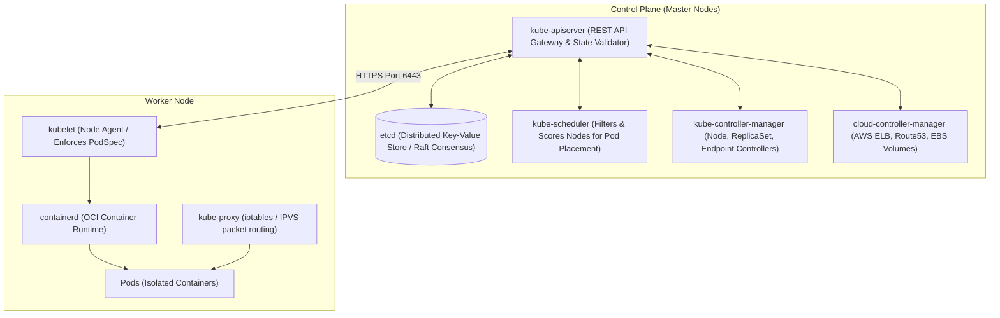
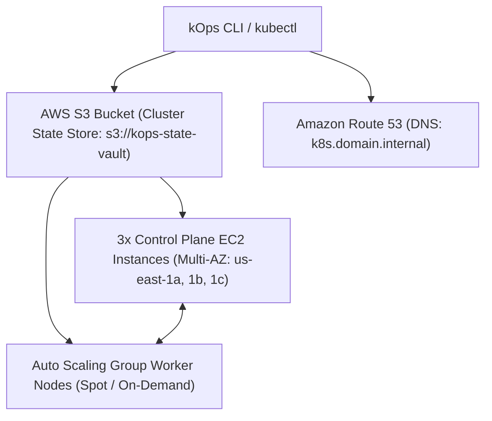

# ☸️ Kubernetes & kOps: The Definitive Master Engineering Guide

> **Authoritative Production Reference & Senior Technical Interview Playbook**  
> Covers Control Plane Internals, Worker Node Daemon Sets, Service Networking, Ingress, Probes, Resource Scheduling, Production YAML Manifests, kOps on AWS EC2, and Diagnostic Troubleshooting.

---

## 📑 Table of Contents
1. [Kubernetes Architecture & Control Plane Internals](#1-kubernetes-architecture--control-plane-internals)
2. [Worker Node Architecture & Container Runtime](#2-worker-node-architecture--container-runtime)
3. [Core Kubernetes Workload Primitives](#3-core-kubernetes-workload-primitives)
4. [Networking, Services & Ingress Deep Dive](#4-networking-services--ingress-deep-dive)
5. [Pod Lifecycle, Probes & Auto-Scaling (HPA)](#5-pod-lifecycle-probes--auto-scaling-hpa)
6. [Storage, Configuration & Secret Governance](#6-storage-configuration--secret-governance)
7. [Production kOps Cluster Architecture on AWS](#7-production-kops-cluster-architecture-on-aws)
8. [Production YAML Manifest Blueprint](#8-production-yaml-manifest-blueprint)
9. [Production Diagnostic & Troubleshooting Playbook](#9-production-diagnostic--troubleshooting-playbook)
10. [Senior Technical Interview Q&A](#10-senior-technical-interview-qa)

---

## 1. Kubernetes Architecture & Control Plane Internals

Kubernetes follows a master-worker distributed architecture. The **Control Plane** makes global decisions about the cluster (scheduling, scaling, detecting events):



### 1.1 The Control Plane Components
1. **`kube-apiserver` (Port 6443):**
   * The central brain and only component that directly talks to `etcd`.
   * Authenticates, authorizes (RBAC), and validates incoming requests from `kubectl` or controllers.
   * Completely stateless; horizontally scalable behind a load balancer.
2. **`etcd` (Ports 2379 / 2380):**
   * High-availability, strongly consistent key-value store holding the complete cluster state.
   * Uses the **Raft consensus algorithm**. Requires an odd number of nodes ($2N+1$) for quorum (e.g., 3 nodes tolerate 1 failure; 5 nodes tolerate 2 failures).
   * **FinOps / DR Rule:** Never run compute workloads on etcd nodes; store etcd on high-IOPS NVMe/EBS (`gp3` with dedicated IOPS) to prevent latency timeouts.
3. **`kube-scheduler`:**
   * Assigns newly created pods with no assigned node (`spec.nodeName` empty) to optimal worker nodes.
   * **Two-Phase Algorithm:**
     1. **Filtering (Predicates):** Eliminates nodes that lack required resources, violate taints/tolerations, or fail nodeSelectors.
     2. **Scoring (Priorities):** Ranks surviving nodes based on resource spread, image locality, and affinity rules.
4. **`kube-controller-manager`:**
   * Runs continuous reconciliation loops: **Current State vs. Desired State**.
   * Bundles core controllers: Node Lifecycle Controller, Deployment/ReplicaSet Controller, Endpoints Controller, ServiceAccount Controller.
5. **`cloud-controller-manager`:**
   * Decouples cloud-specific logic from core Kubernetes. Integrates with AWS/Azure for provisioning Load Balancers (`Type: LoadBalancer`), attaching EBS volumes, and node routing.

---

## 2. Worker Node Architecture & Container Runtime

Worker nodes execute actual application containers:
1. **`kubelet`:**
   * The primary node agent registered with the API Server.
   * Watches `PodSpec` objects assigned to its node and instructs the container runtime via CRI (Container Runtime Interface) to pull images and start/stop containers.
   * Executes startup/liveness/readiness probes and reports node health back to the control plane.
2. **`kube-proxy`:**
   * Network proxy running on every worker node. Reflects Kubernetes `Service` definitions in local node packet routing rules.
   * Modes: **`iptables`** (default, sequential rule evaluation) or **`IPVS`** (IP Virtual Server, hash-table based, $O(1)$ lookup for large clusters with >10,000 services).
3. **`containerd` (CRI Runtime):**
   * Standardized container runtime (dockershim was permanently removed in Kubernetes 1.24+). Manages container lifecycle via runc.

---

## 3. Core Kubernetes Workload Primitives

| Object Type | Primary Use Case | Scaling & State Characteristics |
| :--- | :--- | :--- |
| **Pod** | Atomic deployable unit; shares IP, port space, and storage volumes | Ephemeral; never deploy standalone in production |
| **Deployment** | Stateless web apps, APIs, microservices | Declarative rolling updates, rollbacks, and replica scaling |
| **StatefulSet** | Databases (PostgreSQL, Kafka, Redis, MongoDB) | Stable unique network identities (`pod-0`, `pod-1`), ordered deployment, dedicated persistent storage per replica |
| **DaemonSet** | Node-level system daemons (Promtail, Fluentbit, kube-proxy) | Guarantees exactly one pod runs on every matching worker node |
| **Job / CronJob** | Batch processing, database migrations, nightly backups | Runs run-to-completion tasks; terminates upon success |

---

## 4. Networking, Services & Ingress Deep Dive

### 4.1 Kubernetes Networking Rules
1. Every Pod gets its own unique cluster-wide IP address.
2. Pods can communicate with all other pods across any node without NAT.
3. Node agents (`kubelet`) can communicate with all pods on the same node.

### 4.2 Service Types
* **`ClusterIP` (Default):** Stable virtual IP accessible **only inside the cluster**. Resolves via CoreDNS (`<service>.<namespace>.svc.cluster.local`).
* **`NodePort`:** Allocates a high-range port (`30000-32767`) on every worker node's physical IP address.
* **`LoadBalancer`:** Provisions an external cloud load balancer (e.g., AWS NLB/ALB) pointing to the NodePort automatically.
* **`ExternalName`:** CNAME alias mapping internal DNS to an external domain.

### 4.3 Ingress (`networking.k8s.io/v1`)
Operates at Layer 7 (HTTP/HTTPS). Routes external traffic to internal `ClusterIP` services based on hostnames (`api.example.com`) and paths (`/v1/auth`), managing TLS termination centrally.

---

## 5. Pod Lifecycle, Probes & Auto-Scaling (HPA)

### 5.1 The Three Probes
```yaml
livenessProbe:
  httpGet:
    path: /healthz
    port: 8080
  initialDelaySeconds: 15
  periodSeconds: 10
  failureThreshold: 3
readinessProbe:
  httpGet:
    path: /ready
    port: 8080
  initialDelaySeconds: 5
  periodSeconds: 5
startupProbe:
  httpGet:
    path: /healthz
    port: 8080
  failureThreshold: 30
  periodSeconds: 10
```
* **`startupProbe`:** Guards legacy or slow-starting apps (disables liveness/readiness probes until it passes).
* **`livenessProbe`:** Detects internal deadlocks. **If failed: Kubelet KILLS and restarts the container**.
* **`readinessProbe`:** Detects if app is ready to accept incoming client traffic. **If failed: Pod is removed from Service Endpoints** (zero traffic routed; container is NOT killed).

### 5.2 Horizontal Pod Autoscaler (HPA v2)
Automatically scales deployment replicas based on observed CPU/Memory utilization or custom Prometheus metrics:
```bash
kubectl autoscale deployment web-api --cpu-percent=70 --min=2 --max=10
```

---

## 6. Storage, Configuration & Secret Governance

* **ConfigMap:** Plaintext configuration keys and configuration files decoupled from container images.
* **Secret (`kubernetes.io/opaque`):** Base64 encoded by default. In production, protect secrets with:
  1. AWS KMS encryption at rest for `etcd`.
  2. External Secrets Operator (ESO) syncing from AWS Secrets Manager or HashiCorp Vault.
* **PersistentVolumes (PV) & PersistentVolumeClaims (PVC):**
  * StorageClasses (`gp3` on AWS) allow dynamic provisioning of block volumes.

---

## 7. Production kOps Cluster Architecture on AWS

**kOps (Kubernetes Operations)** is the official production tool for building, provisioning, upgrading, and maintaining enterprise self-managed Kubernetes clusters on AWS EC2.



### 7.1 Key kOps Commands
```bash
# 1. Export state store & cluster name
export KOPS_STATE_STORE="s3://akhil-devops-kops-state-store"
export CLUSTER_NAME="k8s.cloudvault.net"

# 2. Generate cluster configuration with Multi-AZ HA
kops create cluster \
  --name=${CLUSTER_NAME} \
  --state=${KOPS_STATE_STORE} \
  --zones=us-east-1a,us-east-1b,us-east-1c \
  --master-count=3 \
  --master-size=t3.medium \
  --node-count=3 \
  --node-size=t3.medium \
  --dns=private \
  --networking=calico \
  --yes

# 3. Validate cluster readiness
kops validate cluster --wait 10m

# 4. Zero-downtime rolling update after node group edits
kops rolling-update cluster --yes
```

---

## 8. Production YAML Manifest Blueprint

```yaml
apiVersion: apps/v1
kind: Deployment
metadata:
  name: payment-api
  namespace: production
  labels:
    app.kubernetes.io/name: payment-api
    app.kubernetes.io/part-of: checkout-system
spec:
  replicas: 3
  strategy:
    type: RollingUpdate
    rollingUpdate:
      maxSurge: 1
      maxUnavailable: 0
  selector:
    matchLabels:
      app: payment-api
  template:
    metadata:
      labels:
        app: payment-api
    spec:
      securityContext:
        runAsNonRoot: true
        runAsUser: 10001
        fsGroup: 10001
      containers:
        - name: payment-api
          image: 123456789012.dkr.ecr.us-east-1.amazonaws.com/payment-api:v2.4.1
          imagePullPolicy: IfNotPresent
          ports:
            - containerPort: 8080
          resources:
            requests:
              cpu: "250m"
              memory: "256Mi"
            limits:
              cpu: "500m"
              memory: "512Mi"
          securityContext:
            readOnlyRootFilesystem: true
            allowPrivilegeEscalation: false
            capabilities:
              drop: ["ALL"]
          livenessProbe:
            httpGet:
              path: /healthz
              port: 8080
            initialDelaySeconds: 10
            periodSeconds: 10
          readinessProbe:
            httpGet:
              path: /ready
              port: 8080
            initialDelaySeconds: 5
            periodSeconds: 5
---
apiVersion: v1
kind: Service
metadata:
  name: payment-api-svc
  namespace: production
spec:
  type: ClusterIP
  selector:
    app: payment-api
  ports:
    - port: 80
      targetPort: 8080
      protocol: TCP
```

---

## 9. Production Diagnostic & Troubleshooting Playbook

### Diagnostic Triage Command Flow
```bash
# 1. Inspect Pod Status
kubectl get pods -n <ns> -o wide

# 2. Check Event Log (OOMKilled, FailedScheduling, ProbeFailures)
kubectl describe pod <pod_name> -n <ns>

# 3. Stream Container Output
kubectl logs <pod_name> -n <ns> --tail=100 -f
kubectl logs <pod_name> -n <ns> --previous   # View logs of CRASHED container instance!

# 4. Interactive Debugging
kubectl exec -it <pod_name> -n <ns> -- /bin/sh
```

### Common Failure Modes & Fixes
1. **`CrashLoopBackOff`:**
   * *Cause:* Application process throws fatal unhandled exception or terminates immediately.
   * *Fix:* Check `kubectl logs <pod> --previous`. Verify database connection strings and environment variables.
2. **`OOMKilled` (Exit Code 137):**
   * *Cause:* Container memory usage exceeded `resources.limits.memory`.
   * *Fix:* Increase limit in PodSpec or profile memory leak.
3. **`ImagePullBackOff` / `ErrImagePull`:**
   * *Cause:* Typo in image tag, private registry authentication missing (`imagePullSecrets`), or AWS ECR token expired.
4. **`Pending`:**
   * *Cause:* Cluster has insufficient CPU/Memory across all nodes, or node taint lacks matching toleration.
   * *Fix:* Run `kubectl describe pod` to view scheduler predicate errors. Scale node group or adjust resource requests.

---

## 10. Senior Technical Interview Q&A

### Q1. What happens when you type `kubectl apply -f deployment.yaml`?
1. **Client:** `kubectl` validates YAML syntax and transforms it into JSON.
2. **Authentication & Authorization:** Sends HTTPS request to `kube-apiserver`. API server authenticates token/cert and checks RBAC permissions.
3. **Admission Controllers:** Validating and Mutating Webhooks inspect and modify the spec (e.g. inject sidecars).
4. **Persistence:** API server writes the Deployment manifest into `etcd`.
5. **Reconciliation:** `kube-controller-manager` detects the new Deployment and creates a `ReplicaSet`. The ReplicaSet creates the required `Pod` objects in `Pending` state.
6. **Scheduling:** `kube-scheduler` filters and scores available worker nodes, selecting the best node and updating the Pod's `spec.nodeName`.
7. **Execution:** The `kubelet` on the selected worker node notices the pod assignment, calls `containerd` via CRI to pull the image and start containers, configures networking via CNI, and runs health probes.

### Q2. How do you design zero-downtime rolling deployments in Kubernetes?
1. Configure `RollingUpdate` with `maxUnavailable: 0` and `maxSurge: 1`.
2. Configure proper **`readinessProbe`** so traffic is routed only after the application passes health verification.
3. Add a **`preStop` lifecycle hook** (`sleep 10`) to allow `kube-proxy` and Ingress controllers to remove the pod from endpoint tables before SIGTERM is sent.
4. Set a realistic **`terminationGracePeriodSeconds`** (e.g., 45s) to allow ongoing in-flight HTTP requests to complete cleanly.
