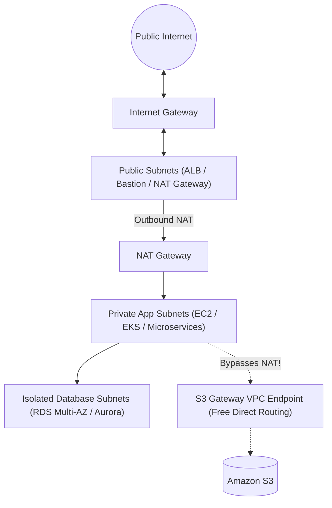
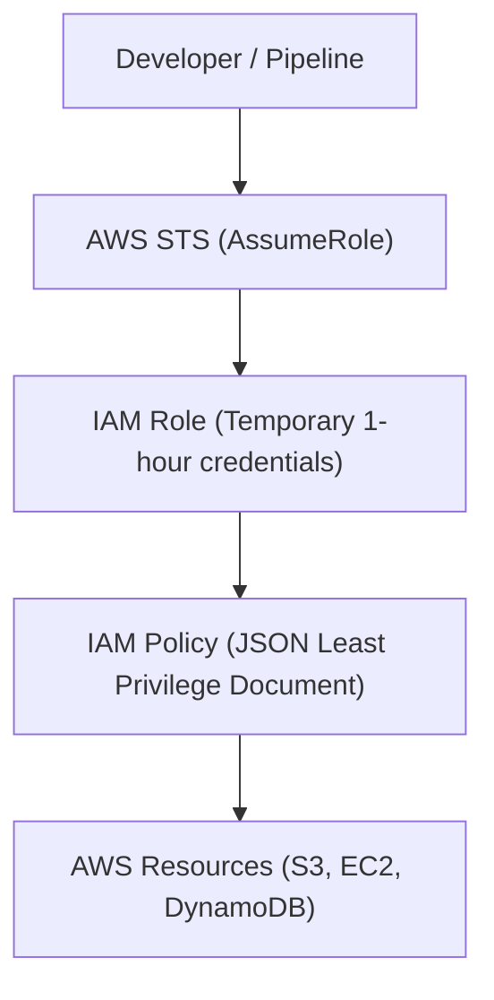

# ☁️ AWS Cloud Architecture: The Definitive Master Engineering Guide

> **Authoritative Enterprise Cloud Architecture Reference & Senior Technical Interview Playbook**  
> Covers Multi-Tier VPC Networking, EC2 Compute & IMDSv2, EBS & S3 Modern Storage, IAM Security Governance, High-Availability Databases (RDS/Aurora), FinOps Cost Optimization, and Production Troubleshooting.

---

## 📑 Table of Contents
1. [Enterprise Cloud Foundations & Architecture Framework](#1-enterprise-cloud-foundations--architecture-framework)
2. [VPC Multi-Tier Networking Deep Dive](#2-vpc-multi-tier-networking-deep-dive)
3. [EC2 Compute, Nitro & Instance Security (IMDSv2)](#3-ec2-compute-nitro--instance-security-imdsv2)
4. [Modern Storage Architectures (EBS gp3 & S3 Lifecycles)](#4-modern-storage-architectures-ebs-gp3--s3-lifecycles)
5. [IAM Security Governance & Least Privilege](#5-iam-security-governance--least-privilege)
6. [Resilient Database Architectures (RDS & Aurora)](#6-resilient-database-architectures-rds--aurora)
7. [FinOps & Cloud Cost Optimization Strategies](#7-finops--cloud-cost-optimization-strategies)
8. [AWS Production Troubleshooting Playbook](#8-aws-production-troubleshooting-playbook)
9. [Senior Cloud Architect Interview Q&A](#9-senior-cloud-architect-interview-qa)

---

## 1. Enterprise Cloud Foundations & Architecture Framework

AWS designs enterprise workloads against the **AWS Well-Architected Framework (6 Pillars)**:
1. **Operational Excellence:** Infrastructure as Code (Terraform/CloudFormation), observability, small reversible changes.
2. **Security:** Least privilege IAM, encryption in transit (TLS 1.3) and at rest (AWS KMS), IMDSv2 enforcement.
3. **Reliability:** Multi-AZ redundancy, Auto Scaling, decoupled queues (SQS/SNS), automated failover.
4. **Performance Efficiency:** Modern compute architectures (AWS Graviton3/4 arm64), serverless event triggers, gp3 EBS storage.
5. **Cost Optimization (FinOps):** S3 Intelligent-Tiering, right-sizing instances, Savings Plans, VPC Gateway Endpoints to eliminate NAT data fees.
6. **Sustainability:** Modern energy-efficient silicon, resource scaling down during idle periods.

---

## 2. VPC Multi-Tier Networking Deep Dive

A production Virtual Private Cloud (VPC) enforces strict isolation across Availability Zones using a **3-Tier Subnet Topology**:



### 2.1 Subnet Architecture Breakdown
1. **Public Subnet (`0.0.0.0/0` -> Internet Gateway `igw-xxxx`):**
   * Hosts only edge traffic routing devices: Application Load Balancers (ALB), NAT Gateways, and optional hardened Bastion hosts.
   * Direct public IPs assigned only to edge entry points.
2. **Private Application Subnet (`0.0.0.0/0` -> NAT Gateway `nat-xxxx`):**
   * Hosts business compute: Kubernetes nodes, backend API servers, EC2 workers.
   * Can initiate **outbound** internet traffic (downloading OS security patches, external API calls) via NAT Gateway.
   * Completely protected from direct inbound internet connections.
3. **Private Isolated Database Subnet (No route to `0.0.0.0/0`):**
   * Hosts relational databases (RDS PostgreSQL/MySQL) and caching tiers (ElastiCache Redis).
   * Air-gapped: No internet access in or out. Accessible solely from Private Application subnets via strict Security Group rules.

### 2.2 Security Groups vs. Network ACLs (NACLs)
| Attribute | Security Groups (SGs) | Network Access Control Lists (NACLs) |
| :--- | :--- | :--- |
| **Operating Level** | Instance / Elastic Network Interface (ENI) level | Subnet boundary level |
| **State Tracking** | **Stateful:** If inbound traffic is allowed, outbound return traffic is automatically permitted regardless of outbound rules. | **Stateless:** Explicit rules required in BOTH inbound and outbound tables (requires allowing ephemeral ports 1024-65535). |
| **Rule Types** | **ALLOW rules only** (implicit deny all else). | **ALLOW and DENY rules** (can explicitly blacklist single attacker IPs). |
| **Evaluation Order** | All rules evaluated simultaneously. | Evaluated in strict sequential numerical order (Rule 100 before Rule 200). |

---

## 3. EC2 Compute, Nitro & Instance Security (IMDSv2)

### 3.1 Instance Families & Architecture
* **General Purpose (`t4g`, `m6i`, `m7g`):** Balanced compute, memory, and networking. (`t` series uses burstable CPU credits).
* **Compute Optimized (`c6i`, `c7g`):** High ratio of vCPU to RAM. Ideal for video transcoding, batch analytics, high-traffic web servers.
* **Memory Optimized (`r6i`, `r7g`):** Massive RAM per vCPU. Ideal for in-memory databases (Redis, SAP HANA) and Elasticsearch.
* **Graviton Processors (`*g` suffix):** Custom AWS ARM-based chips delivering up to **40% better price-performance** compared to x86 equivalents.

### 3.2 IMDSv2 Security Hardening (Defense Against SSRF)
Legacy **IMDSv1** allowed fetching instance role credentials via a simple HTTP GET (`curl http://169.254.169.254/latest/meta-data/iam/security-credentials/`), making applications vulnerable to Server-Side Request Forgery (SSRF) cloud credential theft.

**Modern IMDSv2 requires session-oriented token exchange:**
```bash
# Step 1: Request a time-limited session token via HTTP PUT (TTL 60s)
TOKEN=$(curl -s -X PUT "http://169.254.169.254/latest/api/token" -H "X-aws-ec2-metadata-token-ttl-seconds: 60")

# Step 2: Use the token in an HTTP header to retrieve metadata
curl -s -H "X-aws-ec2-metadata-token: $TOKEN" http://169.254.169.254/latest/meta-data/instance-id
```
* **Production Rule:** Enforce `HttpTokens=required` and `HttpPutResponseHopLimit=1` on all Launch Templates.

---

## 4. Modern Storage Architectures (EBS gp3 & S3 Lifecycles)

### 4.1 Elastic Block Store (EBS)
* **`gp3` (Modern General Purpose SSD - Industry Standard):**
  * Provides baseline **3,000 IOPS and 125 MB/s throughput** out of the box at **20% lower cost** than legacy `gp2`.
  * IOPS and throughput scale **independently** from storage capacity (unlike `gp2` where IOPS were tied to volume size).
* **`io2 Block Express`:** Ultra-low latency, mission-critical databases requiring up to 256,000 IOPS and 99.999% volume durability.
* **Volume Attachment Limit:** EBS volumes are strictly Availability Zone-locked. An EBS volume in `us-east-1a` cannot be directly mounted to an EC2 instance in `us-east-1b` (requires EBS Snapshots for cross-AZ migration).

### 4.2 Simple Storage Service (S3)
* **Default Security:** All new S3 buckets enforce server-side encryption with Amazon S3 managed keys (`SSE-S3`) by default, and Block Public Access is active.
* **S3 Storage Classes & Lifecycle Transitions:**
  ```mermaid
  flowchart LR
      Standard["S3 Standard (Hot Data)"] -->|After 30 Days| StandardIA["S3 Standard-IA (Infrequent Access)"]
      StandardIA -->|After 90 Days| Glacier["S3 Glacier Flexible Retrieval"]
      Glacier -->|After 365 Days| DeepArchive["S3 Glacier Deep Archive ($0.00099/GB/mo)"]
  ```
* **S3 Gateway Endpoint (Cost Optimization):**
  * Routing S3 traffic through a NAT Gateway costs **$0.045/GB** for data processing.
  * Adding a free **S3 Gateway VPC Endpoint** route table entry redirects S3 traffic directly over the AWS private backbone with **$0 data fees**.

---

## 5. IAM Security Governance & Least Privilege



### 5.1 IAM Golden Rules
1. **Never use the AWS Root Account** for everyday administrative tasks; lock it with hardware MFA.
2. **Never store static AWS Access Keys (`AKIA...`)** on EC2 instances or in code. Always assign an **IAM Role with an Instance Profile**.
3. **Enforce Least Privilege:** Restrict actions (`Action: ["s3:GetObject"]`) to specific resource ARNs (`Resource: "arn:aws:s3:::my-secure-bucket/*"`).

---

## 6. Resilient Database Architectures (RDS & Aurora)

### 6.1 RDS Multi-AZ vs. Read Replicas
| Feature | RDS Multi-AZ Deployment | RDS Read Replicas |
| :--- | :--- | :--- |
| **Primary Goal** | **High Availability & Disaster Recovery (DR)** | **Read Scalability & Reporting** |
| **Replication Type** | **Synchronous** block-level replication to standby instance in another AZ. | **Asynchronous** log shipping to independent database instances. |
| **Instance Accessibility** | Standby instance is **inactive/hidden**; cannot accept queries. | Read replicas are **active**; handle `SELECT` queries. |
| **Failover Behavior** | Automatic DNS failover in 60-120 seconds with zero data loss ($RPO=0$). | Manual promotion required; replication lag can cause minor data loss ($RPO>0$). |

### 6.2 Amazon Aurora
* Cloud-native relational engine compatible with PostgreSQL and MySQL.
* Replicates data **6 ways across 3 Availability Zones** on a shared distributed storage volume.
* Storage auto-scales dynamically up to 128 TiB without performance degradation.

---

## 7. FinOps & Cloud Cost Optimization Strategies

1. **VPC NAT Gateway Optimization:** Deploy S3/DynamoDB Gateway Endpoints to remove high-volume traffic from NAT Gateways.
2. **Compute Right-Sizing:** Analyze AWS Compute Optimizer metrics; migrate x86 workloads to AWS Graviton.
3. **Commitment Discounts:**
   * **Compute Savings Plans:** Up to 66% discount for a 1-year or 3-year hourly spend commitment across EC2, Fargate, and Lambda.
   * **Spot Instances:** Up to 90% discount for stateless, fault-tolerant batch workers and Kubernetes worker nodes.
4. **Storage Hygiene:** Migrate legacy `gp2` EBS volumes to `gp3`; implement automated S3 lifecycle expiration rules for old build artifacts and logs.

---

## 8. AWS Production Troubleshooting Playbook

### Scenario 1: Private EC2 Instance Cannot Reach the Internet
1. Verify Route Table: Ensure private subnet route table has `0.0.0.0/0 -> nat-xxxxxxxx`.
2. Verify NAT Gateway Subnet: Ensure NAT Gateway resides in a **Public Subnet** whose route table points to `igw-xxxxxxxx`.
3. Check Security Groups: Ensure outbound SG allows traffic on requested ports (`443`/`80`).
4. Check NACLs: Verify both inbound and outbound ephemeral port rules are not blocked.

### Scenario 2: EC2 Instance CPU Hits 100% and SSH Hangs
1. Access the instance via **AWS Systems Manager (SSM) Session Manager** (does not depend on port 22 or inbound routing).
2. Check top consumers using `top -b -n 1` or `htop`.
3. If completely unresponsive, inspect instance console screenshot via AWS Console to diagnose kernel panic or out-of-memory lockup.

---

## 9. Senior Cloud Architect Interview Q&A

### Q1. How do you architect a multi-region disaster recovery strategy on AWS?
* **RTO (Recovery Time Objective):** How fast you must recover.
* **RPO (Recovery Point Objective):** How much data loss is acceptable.
* **Four DR Patterns (Lowest to Highest Cost/Complexity):**
  1. *Backup & Restore:* Periodic S3 Cross-Region Replication (CRR) and AMI replication. High RTO/RPO.
  2. *Pilot Light:* Core database continuously replicated to secondary region (Aurora Global Database / DynamoDB Global Tables); minimal compute idling.
  3. *Warm Standby:* Scaled-down version of full environment running in secondary region; auto-scales up during disaster.
  4. *Multi-Region Active-Active:* Full production traffic split across regions via Route 53 latency/geo-DNS routing. Near-zero RTO/RPO.

### Q2. What is the difference between an ALB and an NLB?
* **Application Load Balancer (ALB - Layer 7):** Inspects HTTP/HTTPS headers, paths (`/api`), and cookies. Handles TLS termination, redirect rules, and WebSockets.
* **Network Load Balancer (NLB - Layer 4):** Operates on TCP/UDP packet levels. Capable of handling millions of requests per second with ultra-low sub-millisecond latency. Supports static/Elastic IP addresses.
