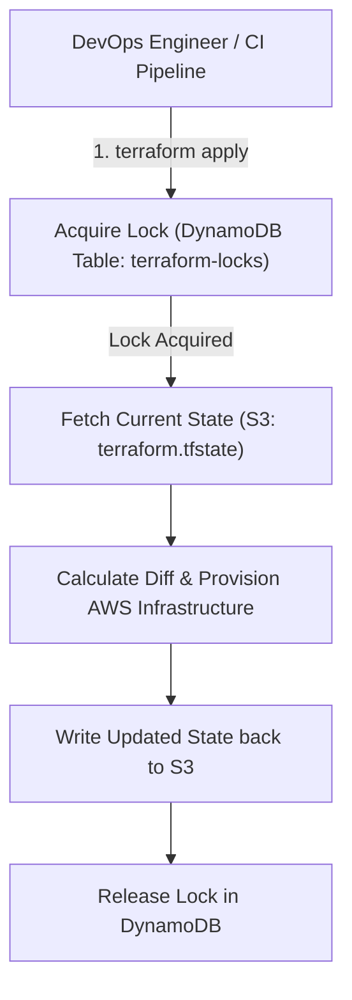

# 🏗️ Terraform Infrastructure as Code: The Definitive Master Engineering Guide

> **Authoritative Enterprise IaC Reference & Senior Technical Interview Playbook**  
> Covers Modern Terraform v1.5+, HCL Syntax, State Locking (S3 + DynamoDB), AWS Provider v5.x Modular Architecture, Lifecycle Rules, Drift Detection, and Incident Recovery.

---

## 📑 Table of Contents
1. [Core IaC Philosophy & Declarative Execution](#1-core-iac-philosophy--declarative-execution)
2. [HCL Syntax, Providers & Resource Architecture](#2-hcl-syntax-providers--resource-architecture)
3. [Enterprise Remote State Architecture (S3 + DynamoDB)](#3-enterprise-remote-state-architecture-s3--dynamodb)
4. [Modern Terraform v1.5+ Features (`import`, `moved`, `check`)](#4-modern-terraform-v15-features-import-moved-check)
5. [Modular Infrastructure Architecture Blueprint](#5-modular-infrastructure-architecture-blueprint)
6. [CLI Workflow & Command Cheat Sheet](#6-cli-workflow--command-cheat-sheet)
7. [State Disaster Recovery & Troubleshooting Playbook](#7-state-disaster-recovery--troubleshooting-playbook)
8. [Senior IaC Technical Interview Q&A](#8-senior-iac-technical-interview-qa)

---

## 1. Core IaC Philosophy & Declarative Execution

* **Declarative (Terraform) vs. Imperative (Ansible / Python Boto3):**
  * **Declarative:** You define the **desired end state** (`I want 3 EC2 instances in us-east-1`). Terraform calculates the delta between reality and code and applies only necessary changes.
  * **Imperative:** You define explicit sequential steps (`Step 1: Create instance A, Step 2: Create instance B`).
* **Idempotency:** Running `terraform apply` 10 times consecutively produces the exact same outcome without creating duplicate duplicate infrastructure.

---

## 2. HCL Syntax, Providers & Resource Architecture

Modern Terraform enforces strict provider constraints and decoupled resource declarations (following **AWS Provider v5.x** standards):

```hcl
terraform {
  required_version = ">= 1.5.0"
  required_providers {
    aws = {
      source  = "hashicorp/aws"
      version = "~> 5.40"
    }
  }
}

provider "aws" {
  region = var.aws_region
  default_tags {
    tags = {
      Environment = var.environment
      ManagedBy   = "Terraform"
      Project     = "CloudVault"
    }
  }
}
```

### 2.1 Decoupled AWS S3 Configuration (Provider v5.x Best Practice)
*In AWS Provider v5.x, inline bucket arguments (`versioning { enabled = true }`) are completely deprecated. Use standalone dedicated resources:*

```hcl
# 1. Base Bucket Resource
resource "aws_s3_bucket" "app_storage" {
  bucket = "${var.environment}-enterprise-app-storage"
}

# 2. Standalone Versioning Resource
resource "aws_s3_bucket_versioning" "app_storage_versioning" {
  bucket = aws_s3_bucket.app_storage.id
  versioning_configuration {
    status = "Enabled"
  }
}

# 3. Standalone Server-Side Encryption
resource "aws_s3_bucket_server_side_encryption_configuration" "app_storage_crypto" {
  bucket = aws_s3_bucket.app_storage.id
  rule {
    apply_server_side_encryption_by_default {
      sse_algorithm = "AES256"
    }
  }
}

# 4. Standalone Public Access Block
resource "aws_s3_bucket_public_access_block" "app_storage_pab" {
  bucket                  = aws_s3_bucket.app_storage.id
  block_public_acls       = true
  block_public_policy     = true
  ignore_public_acls      = true
  restrict_public_buckets = true
}
```

---

## 3. Enterprise Remote State Architecture (S3 + DynamoDB)

The state file (`terraform.tfstate`) is the single source of truth mapping your code to physical cloud resource IDs. In a multi-engineer team, local state files risk **race conditions, corruption, and secret leaks**.



### 3.1 Backend Configuration
```hcl
terraform {
  backend "s3" {
    bucket         = "production-terraform-state-vault"
    key            = "core-infra/vpc/terraform.tfstate"
    region         = "us-east-1"
    encrypt        = true
    dynamodb_table = "terraform-lock-table"
  }
}
```
* **DynamoDB Lock Requirement:** The DynamoDB table must have a Primary Partition Key named **`LockID`** of type **String**.

---

## 4. Modern Terraform v1.5+ Features (`import`, `moved`, `check`)

### 4.1 Declarative `import` Blocks
*Legacy `terraform import` was imperative and did not generate HCL code. Terraform 1.5+ introduces declarative imports directly in `.tf` files:*
```hcl
import {
  to = aws_security_group.web_sg
  id = "sg-0123456789abcdef0"
}
```

### 4.2 Safe Refactoring with `moved` Blocks
*Renaming a resource in code (`aws_instance.web` to `aws_instance.api_server`) previously caused Terraform to DESTROY the old instance and CREATE a new one. `moved` blocks tell Terraform it was merely renamed:*
```hcl
moved {
  from = aws_instance.web
  to   = aws_instance.api_server
}
```

---

## 5. Modular Infrastructure Architecture Blueprint

### 5.1 Standard Module Hierarchy
```
infra/
├── environments/
│   ├── dev/
│   │   ├── main.tf
│   │   ├── variables.tf
│   │   └── terraform.tfvars
│   └── prod/
│       ├── main.tf
│       └── terraform.tfvars
└── modules/
    └── vpc/
        ├── main.tf
        ├── variables.tf
        └── outputs.tf
```

### 5.2 Dynamic Loops & Meta-Arguments
* **`count` vs `for_each`:**
  * Avoid `count` when resources have unique keys (deleting an item from the middle of a `count` list causes destructive re-indexing of all subsequent resources!).
  * Use **`for_each`** with a map or set for safe additions and removals.
* **`lifecycle` Blocks:**
  ```hcl
  lifecycle {
    create_before_destroy = true # Spins up new replacement resource before killing old
    prevent_destroy       = true # Hard guard against accidental 'terraform destroy'
    ignore_changes        = [tags, ami] # Ignores drift from external tools
  }
  ```

---

## 6. CLI Workflow & Command Cheat Sheet

```bash
terraform init -upgrade             # Download providers and configure backend
terraform validate                 # Verify syntax and variable references
terraform fmt -recursive           # Canonical formatting of all .tf files
terraform plan -out=tfplan.binary  # Deterministic execution plan
terraform apply tfplan.binary       # Apply exact plan without re-prompting
terraform refresh                  # Reconcile state file with real-world infrastructure
```

---

## 7. State Disaster Recovery & Troubleshooting Playbook

### Scenario 1: State Lock Stuck (`Error: Error acquiring the state lock`)
* **Root Cause:** A previous `apply` crashed or CI/CD pipeline was terminated mid-run, leaving the lock active in DynamoDB.
* **Resolution:**
  ```bash
  # Identify the Lock ID from the error message (e.g. b5f49e08-xxxx)
  terraform force-unlock <LOCK_ID>
  ```

### Scenario 2: Resource Deleted Manually in AWS Console (State Drift)
* **Root Cause:** AWS state drifted from `terraform.tfstate`.
* **Resolution:**
  ```bash
  terraform plan  # Terraform detects missing resource and proposes recreation
  terraform apply # Re-provisions the resource cleanly
  ```

### Scenario 3: Untangling State Without Destruction
* **Removing without deleting cloud infrastructure:**
  ```bash
  terraform state rm aws_security_group.legacy_sg
  ```
* **Listing all resources currently tracked in state:**
  ```bash
  terraform state list
  ```

---

## 8. Senior IaC Technical Interview Q&A

### Q1. How do you prevent sensitive credentials from leaking in Terraform state?
1. Store state files exclusively in an encrypted remote S3 bucket with strict IAM access.
2. Mark sensitive variables with `sensitive = true` to prevent terminal log exposure.
3. Integrate with external secret management (AWS Secrets Manager or HashiCorp Vault) using dynamic data sources rather than hardcoded string outputs.

### Q2. How do you handle circular dependencies in Terraform?
* Circular dependencies occur when Resource A requires an attribute from Resource B, which simultaneously requires an attribute from Resource A (e.g., Security Group A referencing Security Group B).
* **Fix:** Break the loop by creating standalone attachment resources (e.g., `aws_security_group_rule` declared independently from the base `aws_security_group`).
