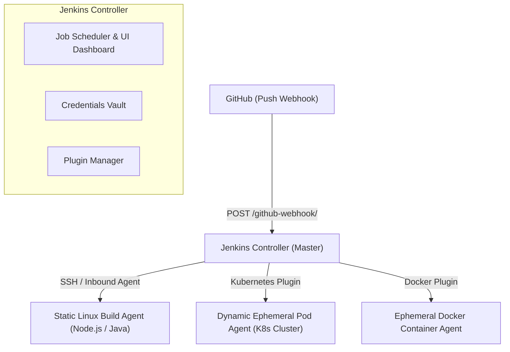

# 🔄 Jenkins CI/CD Automation: The Definitive Master Engineering Guide

> **Authoritative Enterprise CI/CD Reference & Senior Technical Interview Playbook**  
> Covers Distributed Controller-Agent Architecture, Declarative Pipeline Engineering, SonarQube Quality Gates, Nexus Artifact Publishing, Maven Builds, and Pipeline Troubleshooting.

---

## 📑 Table of Contents
1. [Continuous Integration & Delivery Foundations](#1-continuous-integration--delivery-foundations)
2. [Jenkins Controller-Agent Distributed Architecture](#2-jenkins-controller-agent-distributed-architecture)
3. [Declarative vs. Scripted Pipeline Architecture](#3-declarative-vs-scripted-pipeline-architecture)
4. [Enterprise Quality & Artifact Governance (SonarQube & Nexus)](#4-enterprise-quality--artifact-governance-sonarqube--nexus)
5. [End-to-End Production Declarative Jenkinsfile Blueprint](#5-end-to-end-production-declarative-jenkinsfile-blueprint)
6. [Pipeline Security & Secrets Management](#6-pipeline-security--secrets-management)
7. [Production Troubleshooting Playbook](#7-production-troubleshooting-playbook)
8. [Senior CI/CD Technical Interview Q&A](#8-senior-cicd-technical-interview-qa)

---

## 1. Continuous Integration & Delivery Foundations

* **Continuous Integration (CI):** Developers merge code to trunk branch frequently. Every push triggers an automated build and test suite, detecting integration bugs within minutes.
* **Continuous Delivery (CD):** Code is automatically built, tested, and staged for deployment. Release to production requires a manual approval gate.
* **Continuous Deployment:** Every code commit that passes the automated pipeline tests is deployed directly to production with zero human intervention.

---

## 2. Jenkins Controller-Agent Distributed Architecture



* **Jenkins Controller:** Manages configurations, serves the web UI, coordinates build schedules, and records build history. **Never run builds directly on the controller (security & stability risk)**.
* **Build Agents:** Dedicated machines (VMs, Docker containers, or Kubernetes pods) where source code is compiled, tested, and packaged.
* **Dynamic Ephemeral Agents:** Best practice in modern cloud engineering. A Kubernetes pod spins up on demand for a single build job and terminates immediately after execution.

---

## 3. Declarative vs. Scripted Pipeline Architecture

| Feature | Declarative Pipeline (`pipeline { ... }`) | Scripted Pipeline (`node { ... }`) |
| :--- | :--- | :--- |
| **Syntax** | Strict, structured domain-specific language (DSL). | Pure Groovy programming language. |
| **Learning Curve** | Gentle, readable, and standardized across teams. | Steep; requires software development experience. |
| **Error Checking** | Validates syntax before pipeline starts. | Fails at runtime during execution. |
| **State Blocks** | Standardized `stages`, `steps`, `post`, `environment`. | Unstructured programmatic blocks (`try/catch`). |
| **Industry Adoption**| **Industry Standard (90%+ of modern enterprise Jenkinsfiles).** | Legacy (used primarily for ultra-custom edge cases). |

---

## 4. Enterprise Quality & Artifact Governance (SonarQube & Nexus)

### 4.1 SonarQube Code Quality & Security Gates
* **Static Application Security Testing (SAST):** Scans source code for bugs, code smells, vulnerabilities, and unit test code coverage.
* **Quality Gate Enforcement:** If test coverage is below threshold (e.g., < 80%) or critical security vulnerabilities are found, the pipeline halts immediately, preventing flawed artifacts from reaching production.

### 4.2 Sonatype Nexus Repository Manager
* Stores and versions immutable application binaries (`.jar`, `.war`, Docker images, npm packages).
* **Hosted Repositories:** Store internal enterprise releases.
* **Proxy Repositories:** Cache public dependencies (Maven Central, npmjs) locally, dramatically speeding up build times and mitigating external network outages.

---

## 5. End-to-End Production Declarative Jenkinsfile Blueprint

```groovy
pipeline {
    agent {
        label 'linux-build-node'
    }

    options {
        timeout(time: 30, unit: 'MINUTES')
        buildDiscarder(logRotator(numToKeepStr: '15'))
        disableConcurrentBuilds()
    }

    environment {
        APP_NAME     = 'order-service'
        NEXUS_URL    = 'http://nexus.internal.net:8081/repository/maven-releases/'
        SONAR_HOST   = 'http://sonarqube.internal.net:9000'
        REGISTRY_ID  = 'aws-ecr-prod'
    }

    stages {
        stage('Checkout SCM') {
            steps {
                cleanWs()
                checkout scm
            }
        }

        stage('Build & Unit Test') {
            steps {
                sh 'mvn clean package -DskipTests=false'
            }
        }

        stage('SonarQube Quality Gate') {
            steps {
                withSonarQubeEnv('SonarQube-Server') {
                    sh 'mvn sonar:sonar -Dsonar.projectKey=order-service'
                }
                timeout(time: 5, unit: 'MINUTES') {
                    script {
                        def qg = waitForQualityGate()
                        if (qg.status != 'OK') {
                            error "Pipeline aborted due to Quality Gate failure: ${qg.status}"
                        }
                    }
                }
            }
        }

        stage('Publish Artifact to Nexus') {
            steps {
                nexusArtifactUploader(
                    nexusVersion: 'nexus3',
                    protocol: 'http',
                    nexusUrl: 'nexus.internal.net:8081',
                    groupId: 'com.enterprise.app',
                    version: "${BUILD_NUMBER}",
                    repository: 'maven-releases',
                    credentialsId: 'nexus-admin-credentials',
                    artifacts: [
                        [artifactId: "${APP_NAME}", classifier: '', file: "target/${APP_NAME}.jar", type: 'jar']
                    ]
                )
            }
        }

        stage('Container Build & Vulnerability Scan') {
            steps {
                sh "docker build -t ${APP_NAME}:${BUILD_NUMBER} ."
                sh "trivy image --severity HIGH,CRITICAL --exit-code 1 ${APP_NAME}:${BUILD_NUMBER}"
            }
        }

        stage('Deploy to Staging') {
            steps {
                sh "kubectl apply -f k8s/ -n staging"
            }
        }
    }

    post {
        always {
            cleanWs()
        }
        success {
            echo "Pipeline succeeded for build ${BUILD_NUMBER}"
        }
        failure {
            echo "Pipeline failed! Alerting engineering team."
        }
    }
}
```

---

## 6. Pipeline Security & Secrets Management

1. **Credentials Plugin:** Store sensitive items using Jenkins Credentials Manager (`Secret text`, `Username with password`, `SSH Username with private key`).
2. **Never hardcode secrets:** Use `withCredentials([string(credentialsId: 'API_TOKEN', variable: 'TOKEN')]) { ... }` which masks tokens in build console logs.
3. **Role-Based Access Control (RBAC):** Use the Matrix Authorization plugin to restrict job execution and project configuration to authorized developers.

---

## 7. Production Troubleshooting Playbook

### Issue 1: Pipeline Stuck Waiting for an Agent (`'Jenkins' doesn't have label 'xyz'`)
* **Cause:** The agent label specified in the Jenkinsfile does not exist or all agents with that label are offline.
* **Fix:** Go to **Manage Jenkins -> Nodes**, verify agent online status, and ensure the configured label matches `agent { label '...' }`.

### Issue 2: SonarQube `waitForQualityGate()` Times Out
* **Cause:** SonarQube webhook is not configured to send the analysis callback back to `http://jenkins-url/sonarqube-webhook/`.
* **Fix:** In SonarQube administration, navigate to **Configuration -> Webhooks** and add the Jenkins webhook URL.

### Issue 3: Build Fails with `Disk space threshold exceeded`
* **Cause:** Old build workspaces and Docker images filled the agent disk.
* **Fix:** Add `cleanWs()` in the `post { always { ... } }` block and configure Jenkins `logRotator(numToKeepStr: '10')`.

---

## 8. Senior CI/CD Technical Interview Q&A

### Q1. How do you implement a Shared Library in Jenkins?
* A Jenkins Shared Library is a centralized Git repository containing reusable Groovy code.
* **Structure:**
  * `vars/`: Defines custom global pipeline steps (e.g. `deployApp.groovy` executed as `deployApp()`).
  * `src/`: Standard object-oriented Groovy utility classes.
* **Usage:** Loaded at the top of the Jenkinsfile via `@Library('enterprise-shared-library@main') _`.

### Q2. How do you trigger Jenkins builds automatically on Git commits?
* Configure a **GitHub Webhook**:
  1. In GitHub repo settings, add a webhook pointing to `http://<jenkins_ip>:8080/github-webhook/` with Content-Type `application/json`.
  2. Select the `Just the push event`.
  3. In the Jenkins job configuration, check **GitHub hook trigger for GITScm polling**.
