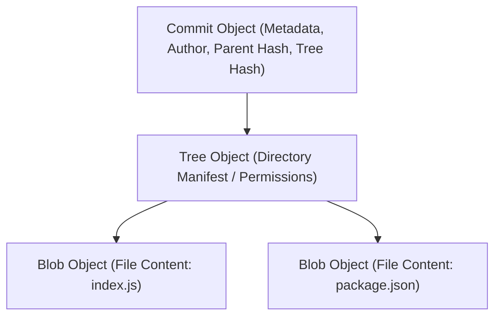
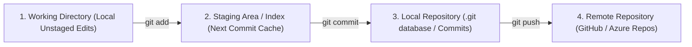

# 🌿 Git Version Control: The Definitive Master Engineering Guide

> **Authoritative Enterprise Version Control Reference & Senior Technical Interview Playbook**  
> Covers Git Object Model Internals (Blobs, Trees, Commits), Staging Index, Detached HEAD Recovery, Merge vs. Rebase, Cherry-Picking, GitFlow, and Production Branch Governance.

---

## 📑 Table of Contents
1. [Git Architecture & Object Model Internals](#1-git-architecture--object-model-internals)
2. [The Three Trees Architecture (Working Directory, Staging, Repository)](#2-the-three-trees-architecture-working-directory-staging-repository)
3. [Branching, Merging & Rebase Strategies](#3-branching-merging--rebase-strategies)
4. [Emergency Recovery & Disaster Playbook](#4-emergency-recovery--disaster-playbook)
5. [Production Branch Governance & GitFlow Workflows](#5-production-branch-governance--gitflow-workflows)
6. [High-Frequency Command Cheat Sheet](#6-high-frequency-command-cheat-sheet)
7. [Senior Version Control Technical Interview Q&A](#7-senior-version-control-technical-interview-qa)

---

## 1. Git Architecture & Object Model Internals

Git is fundamentally a **content-addressable filesystem** built on top of a directed acyclic graph (DAG). All Git data resides inside the `.git/objects/` directory keyed by 40-character SHA-1 (or SHA-256) hashes:



### The 4 Fundamental Git Objects
1. **Blob (Binary Large Object):** Stores raw file contents only. Does not store filenames, directory structures, or file modification timestamps.
2. **Tree:** Represents a directory. Stores file modes (permissions), object types, SHA-1 hashes, and filenames.
3. **Commit:** Captures project snapshot. Contains pointer to root tree object, parent commit hash(es), author/committer info, and commit message.
4. **Annotated Tag:** Permanent point-in-time reference pointing to a specific commit hash with a GPG signature and message.

---

## 2. The Three Trees Architecture (Working Directory, Staging, Repository)



* **`git checkout -- <file>` / `git restore <file>`:** Discards local changes in the working directory, restoring from staging index.
* **`git reset HEAD <file>` / `git restore --staged <file>`:** Unstages changes from index, keeping working directory intact.

---

## 3. Branching, Merging & Rebase Strategies

### 3.1 `git merge` vs. `git rebase`
| Feature | `git merge` | `git rebase` |
| :--- | :--- | :--- |
| **History Structure** | Preserves true non-linear chronological history. Creates an explicit **Merge Commit**. | Re-writes commit history to create a clean, single **linear graph**. |
| **Commit Hashes** | Original commit hashes are completely unchanged. | Re-calculates and creates brand **new commit hashes**! |
| **Safety Rule** | Safe across all public and shared branch workflows. | **Golden Rule:** NEVER rebase a public/shared branch that others have pulled! |
| **Rollback** | Easy to revert via `git revert -m 1 <merge_commit_sha>`. | Harder to untangle once pushed. |

### 3.2 Fast-Forward Merge vs. 3-Way Merge
* **Fast-Forward (`--ff`):** Target branch pointer simply moves forward to the tip of feature branch (possible only when no diverged commits exist on target).
* **3-Way Merge (`--no-ff`):** Used when branches have diverged; combines common ancestor, branch tip 1, and branch tip 2 into a new merge commit.

---

## 4. Emergency Recovery & Disaster Playbook

### Scenario 1: Recovering from a Bad `git reset --hard` (Accidental Loss)
* **Diagnosis:** Commits deleted via hard reset are not immediately purged; they become **dangling commits** preserved in the local **Reflog** for at least 30 days.
* **Recovery:**
  ```bash
  # Step 1: Inspect the reference log of all HEAD movements
  git reflog
  # Output: 3a4b5c6 HEAD@{1}: commit: Important production fix
  # Step 2: Restore branch to that exact state
  git reset --hard HEAD@{1}
  ```

### Scenario 2: Detached HEAD State
* **Cause:** Checked out a specific commit hash or tag directly (`git checkout a1b2c3d`) instead of a branch. New commits are not attached to any branch.
* **Recovery:**
  ```bash
  # Save your detached commits to a brand new branch immediately:
  git branch my-rescued-feature
  git switch my-rescued-feature
  ```

### Scenario 3: Undo an Already Pushed Commit
* **Never use `git reset` on public branches.**
* **Use `git revert`:**
  ```bash
  git revert <bad_commit_hash>
  git push origin main
  # Safely creates a new inverse commit that cancels out changes without breaking history for teammates.
  ```

---

## 5. Production Branch Governance & GitFlow Workflows

### 5.1 Branch Topology
* **`main` (Production):** Protected. Every commit is production-ready and tagged (`v1.0.0`). Zero direct pushes permitted.
* **`develop` (Integration):** Feature branches merge here for continuous testing.
* **`feature/*`:** Short-lived branches branched off `develop` and merged via reviewed Pull Requests (PRs).
* **`hotfix/*`:** Urgent production patches branched directly from `main` and merged back to both `main` and `develop`.

---

## 6. High-Frequency Command Cheat Sheet

```bash
git status -s                           # Compact status
git log --oneline --graph --decorate -n 15 # Visual branch topology
git cherry-pick <commit_sha>            # Apply single commit from another branch
git stash save "wip feature"            # Stash uncommitted changes
git stash pop                           # Restore stashed changes
git diff --staged                       # Inspect changes staged for commit
git branch -d <branch_name>             # Delete merged branch (-D to force)
git remote prune origin                 # Clean up stale remote tracking references
```

---

## 7. Senior Version Control Technical Interview Q&A

### Q1. What is the difference between `git fetch` and `git pull`?
* **`git fetch`:** Downloads new commits, files, and branches from the remote repository into remote-tracking branches (`origin/main`), but **does not alter your working directory or local branches**.
* **`git pull`:** Convenience shortcut that executes **`git fetch` followed immediately by `git merge FETCH_HEAD`** (or `git rebase` if configured).

### Q2. How does Git detect file renames?
* Unlike SVN, Git does not track metadata for file renames.
* Because Git's object model is content-addressable, if a file is moved to a new path with identical or near-identical content, Git computes the hash of the file blob and dynamically detects the rename during `git status` or `git diff` based on similarity scoring.
