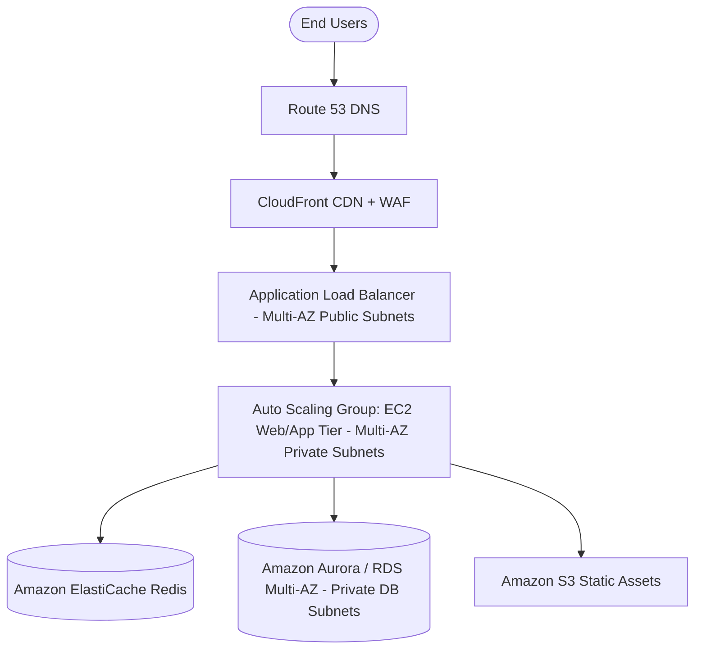

# 🚀 Enterprise Cloud Consulting — Master Interview Question Bank (150+ Questions & Complete Answers)

**Candidate:** Akhil B M (Cloud & DevOps Engineer)  
**Target Role:** Cloud Engineer / Associate Cloud Engineer / DevOps Trainee  
**Company Profile:** **Enterprise Cloud Consulting** — AWS Premier Tier Services Partner  
**Location:** Headquartered on Bengaluru, India  
**Core Competencies Evaluated:** AWS Architecture in-depth, Multi-Cloud (Azure & AWS), Linux Systems, Docker & Kubernetes (kOps & EKS), CI/CD Automation, FinOps (Cost Optimization), and Production Troubleshooting.

---

## 📑 Table of Contents
1. [AWS Core: Compute & EC2 (12 Qs)](#1-aws-core-compute--ec2)
2. [AWS Core: Networking & VPC (12 Qs)](#2-aws-core-networking--vpc)
3. [AWS Core: Storage & Databases (10 Qs)](#3-aws-core-storage--databases)
4. [AWS Core: IAM & Security (10 Qs)](#4-aws-core-iam--security)
5. [AWS Core: Monitoring, Cost Optimization (FinOps) & Management (10 Qs)](#5-aws-core-monitoring-finops--management)
6. [Linux Internals, Commands & System Administration (15 Qs)](#6-linux-internals-commands--admin)
7. [Git & Version Control Workflows (7 Qs)](#7-git--version-control)
8. [CI/CD: Pipelines, Tools & Automation (12 Qs)](#8-cicd-pipelines--automation)
9. [Docker & Container Architecture (10 Qs)](#9-docker--container-architecture)
10. [Kubernetes & kOps Cluster Operations (15 Qs)](#10-kubernetes--kops-cluster-operations)
11. [Infrastructure as Code: Terraform & Ansible (7 Qs)](#11-infrastructure-as-code-terraform--ansible)
12. [Scripting & Automation: Bash & Python Boto3 (5 Qs)](#12-scripting--automation)
13. [Real-World Architecture & Incident Troubleshooting Scenarios (10 Qs)](#13-real-world-scenarios--troubleshooting)
14. [Behavioral, HR & Akhil's Project Deep-Dives (12 Qs)](#14-behavioral-hr--project-deep-dives)

---

## 1. AWS Core: Compute & EC2

### Q1. What are the different EC2 purchase options and when do you choose each?
* **On-Demand:** Pay by the second with no long-term commitment. *Use Case:* Unpredictable, short-term, or development workloads.
* **Reserved Instances (RI) / Savings Plans:** 1 or 3-year commitment offering up to 72% discount. *Savings Plans* offer greater flexibility across instance families and regions. *Use Case:* Steady-state production databases and baseline compute.
* **Spot Instances:** Spare AWS capacity at up to 90% discount, but AWS can terminate with a 2-minute notice. *Use Case:* Stateless batch processing, CI/CD runners, rendering, and resilient worker nodes (with Auto Scaling Spot Fleets).
* **Dedicated Hosts:** Physical servers dedicated to your organization. *Use Case:* Strict compliance, licensing requirements (BYOL based on sockets/cores).

### Q2. What is the difference between an Elastic IP and a Public IP?
* **Public IP:** Automatically assigned from AWS pool on instance launch. It is dynamic—if you stop and restart the instance, the public IP changes. There is no extra charge for using it.
* **Elastic IP (EIP):** A static, persistent IPv4 address allocated to your AWS account. It stays unchanged across instance reboots and stop/start cycles. You can remap it to another instance in seconds during failover. Note: In AWS, an idle/unattached Elastic IP incurs a small hourly fee to prevent IP hoarding.

### Q3. What are EC2 Instance Metadata and User Data?
* **User Data:** A script executed by cloud-init once during the initial first launch of an EC2 instance. Typically used for bootstrapping (installing Docker, Nginx, pulling configs).
* **Instance Metadata (IMDS):** Information about the running instance accessible from inside the VM at `http://169.254.169.254/latest/meta-data/` (instance-id, private-ip, AMI id, attached IAM role security credentials).
  * *Security Note:* Always enforce **IMDSv2** (token-based session headers with `PUT`) to protect against Server-Side Request Forgery (SSRF) vulnerabilities.

### Q4. What happens to data stored on an Instance Store volume when an EC2 instance is stopped vs rebooted?
* **Reboot:** Data persists on the instance store volume.
* **Stop:** When an instance is stopped, it relinquishes its physical host hardware. The data on instance store volumes is **permanently lost** (ephemeral).
* *Architectural Rule:* Instance store is for scratch data, caching, or temporary buffers. Permanent data must always live on Elastic Block Store (EBS) or S3.

### Q5. What is an AMI and how do you create one from a running EC2 instance?
* An **Amazon Machine Image (AMI)** is a pre-configured template containing the OS, application server, and software required to launch an instance. It includes root volume snapshots, launch permissions, and block device mappings.
* To create one: In AWS Console / CLI (`aws ec2 create-image`), select the instance, provide a name. By default, AWS will temporarily pause the file system (reboot) to guarantee filesystem consistency unless `--no-reboot` is explicitly passed.

### Q6. What are EC2 Placement Groups and their types?
* **Cluster:** Instances packed physically close together inside a single Availability Zone. Delivers low-latency 10 Gbps+ network throughput. *Use case:* HPC (High-Performance Computing), Big Data distributed workloads.
* **Spread:** Each instance placed on distinct hardware racks (max 7 instances per AZ). *Use case:* Critical small clusters where hardware isolation is vital.
* **Partition:** Instances divided into logical partitions (racks) that do not share underlying hardware. *Use case:* HDFS, Apache Cassandra, Kafka clusters.

### Q7. How do you resize or modify an EBS volume without incurring any downtime?
* AWS EBS supports **Elastic Volumes**. You can increase the volume size or change volume type (e.g., `gp2` to `gp3` for better baseline IOPS and lower cost) while the instance is running without detachment:
  1. Modify volume via AWS CLI: `aws ec2 modify-volume --volume-id vol-xxx --size 30`.
  2. SSH into the instance and expand the partition: `sudo growpart /dev/xvda 1`.
  3. Expand the filesystem: `sudo resize2fs /dev/xvda1` (ext4) or `sudo xfs_growfs -d /` (XFS).

### Q8. What is the difference between Stopping and Terminating an EC2 instance?
* **Stopping:** The instance shuts down; EBS root volume is preserved; hourly EC2 compute charges halt, but you still pay for EBS storage and unattached Elastic IPs. Can be started again at any time.
* **Terminating:** The instance is permanently deleted. By default, the root EBS volume is deleted (if `DeleteOnTermination: true`), and attached Elastic IPs are disassociated.

### Q9. What is AWS Lambda, and when do you choose it over EC2?
* **Lambda:** Event-driven, fully managed serverless compute that executes code in response to events (S3 upload, API Gateway request, DynamoDB stream) without provisioning servers. Auto-scales from 0 to thousands of concurrent executions.
* *Choose Lambda when:* Execution is short-lived (< 15 min), stateless, sporadic, or cost-driven.
* *Choose EC2 when:* Workloads require persistent connections (WebSockets), long background jobs, specialized hardware/kernels, or predictable high 24/7 utilization where instances or containers are cheaper.

### Q10. What is the difference between ECS, EKS, and AWS Fargate?
* **ECS (Elastic Container Service):** AWS-native, lightweight container orchestrator. Fast setup, deeply integrated with IAM and CloudWatch.
* **EKS (Elastic Kubernetes Service):** Managed Kubernetes control plane. Standard CNCF compliance; best for multi-cloud parity and complex microservices.
* **AWS Fargate:** A serverless compute engine for both ECS and EKS. Eliminates the need to provision, patch, and manage EC2 worker nodes. You pay strictly for vCPU and memory allocated to containers.

### Q11. What is the difference between Vertical Scaling and Horizontal Scaling in AWS?
* **Vertical Scaling (Scale Up/Down):** Changing the instance type to a larger or smaller size (e.g., resizing `t3.medium` to `m5.xlarge`). Requires brief downtime to stop and modify instance.
* **Horizontal Scaling (Scale Out/In):** Adding or removing instances behind an Application Load Balancer using an **Auto Scaling Group (ASG)** based on CPU utilization or target tracking metrics. Provides zero downtime and true high availability.

### Q12. How do you securely connect to a private EC2 instance without a public IP?
1. **AWS Systems Manager (SSM) Session Manager (Recommended Best Practice):** Attach an IAM role with `AmazonSSMManagedInstanceCore` to the private EC2 instance. Connect via AWS Console or CLI (`aws ssm start-session --target i-xxxx`). No inbound port 22 open, no bastion host needed, all commands logged to CloudWatch/S3.
2. **Bastion Host (Jump Box):** Deploy a small hardened EC2 instance in the Public Subnet with SSH restricted to your corporate IP, then jump from the bastion into the private instance.
3. **AWS Client VPN / Direct Connect:** Direct encrypted network tunnel from on-premises to the private VPC subnet.

---

## 2. AWS Core: Networking & VPC

### Q13. What is the difference between a Security Group and a Network Access Control List (NACL)?
| Feature | Security Group (SG) | Network ACL (NACL) |
| :--- | :--- | :--- |
| **Level** | Instance / ENI level | Subnet level |
| **State** | **Stateful** (Return traffic is automatically allowed regardless of inbound rules) | **Stateless** (Inbound and outbound rules must be explicitly configured) |
| **Rule Type** | **Allow rules only** | **Allow and Deny rules** |
| **Evaluation** | All rules evaluated together | Evaluated in numerical order (lowest number first) |

### Q14. What makes a VPC Subnet Public vs Private?
* **Public Subnet:** Its associated Route Table has an explicit route pointing to an **Internet Gateway (IGW)** (`0.0.0.0/0 -> igw-xxxx`).
* **Private Subnet:** Its Route Table does **NOT** route to an IGW. To download internet patches, it routes through a **NAT Gateway** located in a public subnet (`0.0.0.0/0 -> nat-xxxx`).

### Q15. What is a NAT Gateway vs a NAT Instance?
* **NAT Gateway:** Managed AWS service. Scales automatically up to 45 Gbps, high availability within the AZ, no OS management, zero security group maintenance.
* **NAT Instance:** Self-managed EC2 instance running Linux with `iptables` IP forwarding enabled. You manage patching, sizing, and failover. Deprecated for production environments.

### Q16. How many VPCs are allowed per AWS Region by default, and can it be increased?
* Default quota is **5 VPCs per Region**. It is a soft limit that can be increased by submitting a Service Quota request in AWS Console.

### Q17. What are VPC Endpoints, and what is the difference between Gateway and Interface Endpoints?
* VPC Endpoints allow private connections between your VPC and supported AWS services without traversing the public internet or needing a NAT Gateway.
* **Gateway Endpoints:** Free route table targets. Supported for **Amazon S3** and **DynamoDB**.
* **Interface Endpoints (AWS PrivateLink):** Provisions an Elastic Network Interface (ENI) with a private IP in your subnet. Supports most AWS services (ECR, SSM, SQS, SNS). Incurs an hourly and data-transfer cost.

### Q18. How do you plan the CIDR range and subnets for a production VPC?
* Standard VPC block: `10.0.0.0/16` (65,536 private IP addresses).
* Split across at least 2 or 3 Availability Zones (AZs) for high availability:
  * Public Subnets: `10.0.1.0/24` (AZ-a), `10.0.2.0/24` (AZ-b) for ALBs and NAT Gateways.
  * Private App Subnets: `10.0.10.0/24` (AZ-a), `10.0.20.0/24` (AZ-b) for EC2/EKS workloads.
  * Private DB Subnets: `10.0.100.0/24` (AZ-a), `10.0.200.0/24` (AZ-b) for RDS databases with no internet access.
* *Rule:* Never overlap CIDRs with on-prem networks or peered VPCs.

### Q19. What is the Route Table and what is the Main Route Table?
* A Route Table contains a set of rules (called routes) that determine where network traffic from your subnet or gateway is directed.
* Every subnet must be associated with a route table. If you do not explicitly associate a subnet with a custom route table, it implicitly uses the **Main Route Table** of the VPC.

### Q20. What is VPC Peering vs AWS Transit Gateway?
* **VPC Peering:** A 1-to-1 network connection between two VPCs. Non-transitive (if VPC A peers with B, and B with C, A cannot talk to C). Managing connections for dozens of VPCs creates a complex mesh ($N(N-1)/2$).
* **AWS Transit Gateway (TGW):** A central regional cloud hub that connects hundreds of VPCs and on-premises networks via a single hub-and-spoke architecture. Simplifies routing and enables centralized inspection.

### Q21. What is AWS Route 53 and what are its core Routing Policies?
Amazon Route 53 is a highly available and scalable DNS web service.
* **Simple:** Single resource (e.g., single web server IP).
* **Weighted:** Distributes traffic based on assigned percentages (useful for A/B testing).
* **Latency:** Routes users to the AWS region that provides the lowest network latency.
* **Failover:** Active-Passive disaster recovery. Routes to primary if health check passes, else secondary.
* **Geolocation / Geoproximity:** Routes traffic based on the geographic location of the caller.
* **Multi-Value Answer:** Returns multiple healthy IP addresses with health checking.

### Q22. What is AWS CloudFront and how does it reduce latency?
* CloudFront is a Content Delivery Network (CDN) that delivers data, videos, applications, and APIs globally using 600+ edge locations.
* It caches static and dynamic web content close to viewers, terminates TLS connections at the edge, and supports Origin Shield to protect backend origin servers from traffic spikes.

### Q23. Can two instances in different subnets of the same VPC communicate by default?
* **Yes.** Every VPC route table contains a default local route (e.g., `10.0.0.0/16 -> local`) that cannot be deleted. All subnets inside the same VPC can route to each other by default unless explicitly blocked by a **NACL** or **Security Group**.

### Q24. How do you troubleshoot an EC2 instance in a public subnet that is not reachable via SSH?
1. **Security Group:** Verify port 22 is allowed from your client public IP.
2. **NACL:** Verify inbound port 22 and outbound ephemeral ports (1024-65535) are allowed.
3. **Route Table:** Ensure route `0.0.0.0/0` points to an Internet Gateway (`igw-xxxx`).
4. **Public IP:** Verify the instance has an assigned Public IP or Elastic IP.
5. **Key Pair & User:** Verify you are using the correct `.pem` key file and default OS username (`ubuntu`, `ec2-user`).
6. **EC2 Status Checks:** Verify Instance Status Check and System Status Check are `2/2 passed`.

---

## 3. AWS Core: Storage & Databases

### Q25. Compare EBS, S3, and EFS: When do you use each?
* **Amazon S3 (Simple Storage Service):** Object storage. Unlimited scale, accessible over HTTPS API, 99.999999999% (11 9s) durability. *Use Case:* Static assets, backups, data lakes, media files.
* **Amazon EBS (Elastic Block Store):** Block storage attached to a single EC2 instance in the same AZ. Operates like a virtual hard drive. *Use Case:* Boot volumes, transactional databases (MySQL, PostgreSQL).
* **Amazon EFS (Elastic File System):** Managed POSIX NFS network file system. Can be mounted concurrently across thousands of EC2 instances and EKS pods across multiple AZs. *Use Case:* Shared CMS (WordPress), shared storage for containerized pods.

### Q26. What are the Amazon S3 Storage Classes and Lifecycle Rules?
* **S3 Standard:** High frequency access, millisecond latency.
* **S3 Standard-IA (Infrequent Access):** Lower storage cost, but retrieval fee.
* **S3 One Zone-IA:** Stored in a single AZ (20% cheaper); data lost if AZ destroyed.
* **S3 Glacier Flexible Retrieval:** Archive data; retrieval options from 1 minute (expedited) to 5 hours.
* **S3 Glacier Deep Archive:** Lowest cost in cloud (cents per TB/month); retrieval within 12 hours.
* **S3 Intelligent-Tiering:** Automatically moves objects between tiers based on changing access patterns without operational overhead or retrieval fees.
* **Lifecycle Rules:** Automation policies to transition objects (e.g., move to IA after 30 days, Glacier after 90 days, expire/delete after 365 days) for massive FinOps savings.

### Q27. What is an S3 Pre-signed URL?
* A temporary URL generated using your AWS IAM credentials that grants someone access to download or upload a specific S3 object without giving them AWS credentials or making the bucket public. It includes an expiration window (e.g., valid for 15 minutes).

### Q28. How do you secure an Amazon S3 Bucket in production?
1. Enable **S3 Block Public Access** at account and bucket level.
2. Enforce encryption: Default SSE-S3 or SSE-KMS with customer-managed keys.
3. Enforce **HTTPS only** via Bucket Policy: Condition `"aws:SecureTransport": "false"` -> Deny.
4. Enable **S3 Versioning** and **MFA Delete** to protect against accidental deletion or ransomware.
5. Use S3 Object Lock for WORM (Write Once, Read Many) compliance.

### Q29. What is the difference between Amazon RDS Read Replicas vs Multi-AZ Deployments?
| Feature | Multi-AZ Deployment | Read Replicas |
| :--- | :--- | :--- |
| **Primary Goal** | **High Availability & Disaster Recovery** | **Read Performance & Scalability** |
| **Replication** | Synchronous to a standby instance in another AZ | Asynchronous to read-only replica instances |
| **Failover** | Automatic failover with zero manual intervention | Can be manually promoted to standalone DB |
| **Database Access** | Standby database is **not** accessible for queries | Read Replicas are active and accept read queries (`SELECT`) |

### Q30. What is Amazon Aurora and how does it differ from traditional RDS?
* Aurora is AWS's cloud-native, MySQL- and PostgreSQL-compatible relational database engine.
* Delivers up to 5x throughput of MySQL and 3x of PostgreSQL.
* Storage is decoupled from compute; storage auto-scales up to 128 TiB and replicates 6 copies across 3 AZs.
* Supports **Aurora Serverless v2** which scales compute in fine-grained increments within milliseconds, optimizing cost for spiky workloads.

### Q31. What is Amazon ElastiCache and when do you introduce it?
* Managed in-memory caching service supporting **Redis** and **Memcached**.
* Placed in front of databases (like RDS) to cache frequent read queries (`key-value`), reducing database load and delivering microsecond read latency.

### Q32. How do you take and restore an RDS backup?
* **Automated Backups:** Daily snapshot + transaction logs stored in S3, allowing Point-In-Time Restore (PITR) to any second within the retention period (1 to 35 days).
* **Manual Snapshots:** User-triggered snapshots that persist until explicitly deleted.
* *Restoring:* RDS always creates a **brand new DB instance** with a new endpoint; it never overwrites the existing instance.

### Q33. RDS vs DynamoDB: When do you pick which?
* **RDS:** Relational data requiring complex SQL joins, multi-table transactions (ACID), foreign keys, and structured schema.
* **DynamoDB:** Fully managed NoSQL key-value and document database. Unlimited scale with consistent single-digit millisecond latency at any throughput. Best for shopping carts, user sessions, gaming leaderboards, and serverless architectures.

### Q34. What is the difference between an EBS Snapshot and an AMI?
* **EBS Snapshot:** A point-in-time incremental backup of a specific block storage volume stored redundantly in S3.
* **AMI:** A complete bootable image package that includes metadata, OS configs, and mappings to one or more EBS snapshots (root volume + data volumes).

---

## 4. AWS Core: IAM & Security

### Q35. What is an IAM Policy, and what is the difference between Identity-based and Resource-based policies?
* **IAM Policy:** A JSON document defining permissions using `Effect` (Allow/Deny), `Action`, `Resource`, and `Condition`.
* **Identity-based Policy:** Attached to an IAM User, Group, or Role (e.g., allowing an engineer to describe EC2).
* **Resource-based Policy:** Attached directly to a resource (e.g., S3 Bucket Policy, KMS Key Policy, SQS Policy) specifying who can access that specific resource.

### Q36. What is the Principle of Least Privilege?
* Granting only the bare minimum permissions necessary for an entity to perform its job, for the shortest required time. Never assign `AdministratorAccess` or wildcard `*` permissions to application roles or individual users.

### Q37. What is an IAM Role vs an IAM User? When do you attach a Role to an EC2 instance?
* **IAM User:** A long-term identity with permanent credentials (username/password or Access Key/Secret Key) for human access.
* **IAM Role:** An identity with temporary credentials assumed by services, applications, or cross-account users.
* *EC2 Instance Profile:* You attach an IAM Role to an EC2 instance so software running on the instance (e.g., AWS CLI, Python boto3) automatically gets temporary rotating credentials from the instance metadata service. You **never** hardcode access keys on an EC2 server!

### Q38. What is AWS Security Token Service (STS) and how does it work?
* A web service that issues temporary, limited-privilege credentials for IAM users or federated users.
* Common API call: `sts:AssumeRole`, returning an Access Key ID, Secret Access Key, and Session Token valid from 15 minutes up to 12 hours.

### Q39. What is AWS KMS and what is Envelope Encryption?
* **AWS KMS (Key Management Service):** Managed service for creating and controlling cryptographic keys (Customer Master Keys / KMS keys).
* **Envelope Encryption:** Encrypting plaintext data with a unique **Data Key**, and then encrypting the Data Key with a top-level **KMS Key**. Protects data while avoiding sending massive raw payloads through KMS APIs.

### Q40. What is AWS Secrets Manager vs AWS Systems Manager Parameter Store?
* **Systems Manager Parameter Store:** Plaintext or encrypted (SecureString) hierarchical storage for configuration parameters and license codes. Free for standard tier.
* **AWS Secrets Manager:** Designed specifically for secrets (database credentials, API keys). Features built-in automatic credential rotation (e.g., rotating RDS passwords using Lambda) and cross-account access. Incurs a small monthly fee per secret.

### Q41. Differentiate AWS Config, Amazon GuardDuty, and AWS Security Hub in one line each:
* **AWS Config:** Audits, tracks, and evaluates resource configuration changes against compliance rules over time.
* **Amazon GuardDuty:** Intelligent threat detection service that continuously monitors CloudTrail logs, VPC flow logs, and DNS logs for malicious activity.
* **AWS Security Hub:** Central posture management dashboard that aggregates and prioritizes security alerts across GuardDuty, Inspector, and IAM Access Analyzer.

### Q42. Explain the AWS Shared Responsibility Model.
* **Security OF the Cloud (AWS):** Physical data centers, host hardware, virtualization software, physical networking, and managed service infrastructure.
* **Security IN the Cloud (Customer):** Guest OS patches, firewall configurations (Security Groups/NACLs), IAM permissions, application code, network configuration, and data encryption.

### Q43. How do you rotate AWS IAM Access Keys safely with zero application downtime?
1. Generate a **second Access Key** for the IAM user in AWS IAM.
2. Update the application / CI/CD pipeline secrets with the new key.
3. Test and confirm application functionality with the new key.
4. Set the old key status to **Inactive** in AWS IAM.
5. Once confirmed that no traffic uses the old key, permanently **Delete** the old key.

### Q44. How do you implement Cross-Account IAM Roles?
* In Account B (Target), create an IAM Role specifying Account A's account ID in the **Trust Policy** (`Principal: { AWS: "arn:aws:iam::AccountA:root" }`).
* In Account A (Source), attach an identity policy to the user/service allowing `sts:AssumeRole` on Account B's role ARN.
* The application in Account A calls `sts:AssumeRole` to retrieve temporary session credentials to perform actions in Account B.

---

## 5. AWS Core: Monitoring, FinOps & Management

### Q45. What is the difference between Amazon CloudWatch and AWS CloudTrail?
* **CloudWatch:** Monitors performance metrics, CPU/memory, operational logs, and sets alarms on system health. (Answers: *"How is my application performing?"*).
* **CloudTrail:** Records every API call made in your AWS account (who did what, from where, and when). (Answers: *"Who changed my security group or launched this instance?"*).

### Q46. What is FinOps and what strategies do you use to reduce AWS costs?
* **FinOps (Cloud Financial Management):** Aligning cloud spending with business value through visibility, optimization, and governance.
* **Key Cost Reduction Strategies:**
  1. Identify & delete unattached EBS volumes and unassociated Elastic IPs.
  2. Implement S3 Lifecycle policies (transition old data to Glacier or Deep Archive).
  3. Migrate from `gp2` to `gp3` EBS volumes (20% instant savings + better baseline performance).
  4. Rightsize over-provisioned EC2/RDS instances using **AWS Compute Optimizer**.
  5. Purchase Compute Savings Plans for baseline steady-state compute.
  6. Use Spot Instances in Auto Scaling Groups for stateless worker nodes and CI/CD pipelines.
  7. Implement automated schedules (via Lambda/EventBridge) to stop non-production dev/staging instances outside business hours.

### Q47. How do you set up an automated CloudWatch Alarm for high CPU with SNS email notification?
1. Create an **Amazon SNS Topic** (e.g., `DevOps-Alerts`) and subscribe your email; confirm the verification link.
2. Open CloudWatch Alarms -> Create Alarm -> Metric: `AWS/EC2 > CPUUtilization`.
3. Set condition: Static threshold `CPUUtilization >= 80%` for 2 consecutive 5-minute periods.
4. Define action: Trigger notification to the SNS topic `DevOps-Alerts` when state changes to `In Alarm`.
5. Name and save the alarm.

### Q48. Name the 6 Pillars of the AWS Well-Architected Framework:
1. **Operational Excellence:** Running and monitoring systems to deliver business value and continuously improving processes.
2. **Security:** Protecting information, data, and assets while delivering value through risk assessments and mitigation strategies.
3. **Reliability:** Ability of a workload to perform its intended function correctly and consistently (fault tolerance, disaster recovery).
4. **Performance Efficiency:** Using computing resources efficiently to meet requirements as demand changes.
5. **Cost Optimization:** Avoiding unnecessary costs and maximizing return on cloud investment (FinOps).
6. **Sustainability:** Minimizing the environmental impacts of running cloud workloads.

### Q49. What is the difference between Amazon SNS, Amazon SQS, and Amazon EventBridge?
* **SNS (Simple Notification Service):** Pub/Sub push notification service. 1 publisher publishes to a topic; it fans out immediately to multiple subscribers (email, SMS, Lambda, SQS).
* **SQS (Simple Queue Service):** Message queuing service (Pull model). Decouples distributed application components. Messages sit in queue until consumer polls and processes them.
* **EventBridge:** Serverless event bus that connects application data from SaaS apps, AWS services, and custom applications with schema discovery and advanced content filtering.

### Q50. What is Disaster Recovery (DR) in AWS and what are the 4 common DR strategies?
* **RTO (Recovery Time Objective):** Maximum acceptable duration of downtime before system recovery.
* **RPO (Recovery Point Objective):** Maximum acceptable data loss duration.
* **4 DR Strategies (from lowest cost/highest RTO to highest cost/lowest RTO):**
  1. *Backup & Restore:* Regular snapshots/backups restored after disaster (Hours/Days).
  2. *Pilot Light:* Core data replicated continuously; minimal skeleton infrastructure launched (Minutes/Hours).
  3. *Warm Standby:* Scaled-down version of full environment always running in second region (Minutes).
  4. *Multi-Site Active-Active:* Full production running in 2+ regions simultaneously with Route 53 latency/failover routing (Near 0 seconds).

---

## 6. Linux Internals, Commands & System Administration

### Q51. What commands do you run first when a Linux server is reported as sluggish?
1. `uptime` / `top` or `htop`: Check CPU load averages (1, 5, 15 min) and top CPU-hogging processes.
2. `free -m` / `free -h`: Check available RAM and whether the system is aggressively swapping.
3. `df -h` & `df -i`: Check disk space and inode consumption across all mounted filesystems.
4. `vmstat 1 5` / `iostat -xz 1 5`: Check for high I/O wait (`%iowait`) indicating disk bottlenecks.
5. `dmesg -T | tail -50` / `journalctl -xe`: Check for kernel panics, OOM (Out Of Memory) killer events, or hardware errors.

### Q52. Explain file permission `755` in Linux.
* Linux permissions format: `User (Owner) | Group | Others`.
* Values: Read (`r` = 4), Write (`w` = 2), Execute (`x` = 1).
* `7` = 4+2+1 = User has Read, Write, and Execute.
* `5` = 4+0+1 = Group has Read and Execute.
* `5` = 4+0+1 = Others have Read and Execute.

### Q53. How do you find which process is listening on Port 80, and how do you kill it?
* Find process: `sudo ss -tulnp | grep :80` or `sudo lsof -i :80` or `sudo netstat -tulpn | grep :80`.
* Identify the PID (e.g., PID `1234`).
* Graceful termination: `sudo kill 1234` (SIGTERM - signal 15).
* Forceful termination if unresponsive: `sudo kill -9 1234` (SIGKILL - signal 9).

### Q54. What is the difference between `kill` (SIGTERM) and `kill -9` (SIGKILL)?
* **SIGTERM (15):** Requests polite shutdown. The application catches the signal, finishes active transactions, closes database handles, cleans up temp files, and exits cleanly.
* **SIGKILL (9):** Kernel forcefully and immediately halts the process execution. Process cannot intercept or ignore signal 9; can cause database corruption if killed mid-write.

### Q55. What is an Inode, and what causes "No space left on device" when `df -h` shows 50% free disk?
* An **Inode** is a data structure on Linux filesystems that stores metadata about a file (permissions, owner, size, block pointers), except its name and actual content.
* If a directory has millions of tiny files (e.g., session files, cache, mail queues), the filesystem can exhaust its allocated **Inodes** before running out of gigabytes.
* Check with: `df -i`. If Inodes are 100%, delete old files: `find /var/log -type f -delete`.

### Q56. Differentiate `grep`, `awk`, and `sed` with practical examples:
* **`grep`:** Fast pattern searching.
  * *Example:* `grep -i "error" /var/log/nginx/error.log`
* **`sed`:** Stream Editor for text parsing and replacement.
  * *Example:* `sed -i 's/http:\/\/127.0.0.1/https:\/\/api.mydomain.com/g' config.json`
* **`awk`:** Powerful text processing and column extraction language.
  * *Example:* Extract 9th column (HTTP status code) from access log: `awk '{print $9}' access.log | sort | uniq -c`

### Q57. What is the difference between a Hard Link and a Soft Link (Symbolic Link)?
* **Hard Link:** A pointer pointing directly to the underlying inode on disk. Shares the same inode number. If original file is deleted, data remains accessible through the hard link. Cannot link directories or span across different filesystem partitions.
* **Soft Link (`ln -s`):** A pointer file pointing to the pathname of the target file. Has its own unique inode. If target file is deleted, the soft link becomes broken (dangling). Can span across filesystems and link directories.

### Q58. Explain the Cron syntax `* * * * *` and schedule a daily backup at 2:30 AM:
* Fields: `Minute (0-59) | Hour (0-23) | Day of Month (1-31) | Month (1-12) | Day of Week (0-6, 0=Sun)`
* Schedule daily at 2:30 AM:
  ```cron
  30 2 * * * /usr/local/bin/backup_script.sh >> /var/log/backup.log 2>&1
  ```

### Q59. What is a Zombie Process and how do you resolve it?
* A **Zombie process** (defunct) is a process that has completed execution via `exit()`, but its entry remains in the process table because its parent process has not yet read its exit status via `wait()`.
* Zombie processes consume no memory or CPU, only a PID slot.
* You cannot kill a zombie with `kill -9` (it is already dead). You must kill or restart the **parent process** (`kill -HUP <ppid>`), causing the `init` or `systemd` process (PID 1) to adopt and reap it.

### Q60. How do you set up passwordless SSH authentication between two servers?
1. On source server: Generate key pair: `ssh-keygen -t rsa -b 4096`.
2. Copy public key to destination server: `ssh-copy-id username@remote-server-ip`.
3. Verifies that public key is appended to `~/.ssh/authorized_keys` on remote server with permissions `600` (and `~/.ssh` has `700`).
4. Test login: `ssh username@remote-server-ip` (no password prompt).

### Q61. What is Swap space and when should you tune `swappiness`?
* **Swap** is space on a disk partition or file used when physical RAM is exhausted, moving idle pages from RAM to disk.
* `vm.swappiness` (0 to 100) controls how aggressively the kernel swaps memory pages.
* For databases and Kubernetes nodes: Set `vm.swappiness = 1` or `10` so the kernel avoids swapping actively used database memory pages, preventing extreme latency spikes.

---

## 7. Git & Version Control

### Q62. What is the difference between `git fetch` and `git pull`?
* `git fetch`: Downloads commits, files, and refs from the remote repository into your local repository, but does **not** merge them into your current working branch. Allows safe inspection (`git diff HEAD..origin/main`).
* `git pull`: Executes `git fetch` followed immediately by `git merge FETCH_HEAD`, automatically integrating remote changes into your active branch.

### Q63. What is `git reset` vs `git revert`?
* `git reset`: Moves the HEAD pointer backward in history.
  * `--soft`: Keeps changes staged.
  * `--hard`: Destroys all uncommitted working directory changes. (Never use on shared remote branches!).
* `git revert`: Creates a **brand new commit** that inverses the changes of a target commit. Safe for shared branches because it preserves commit history.

### Q64. What is the difference between `git merge` and `git rebase`?
* **`git merge`:** Combines two branches by creating a distinct 3-way merge commit. Preserves exact historical timeline and context of branch creation and merging.
* **`git rebase`:** Takes your branch's commits and replays them one by one on top of the target base branch. Creates a clean, linear commit history, but rewrites commit hashes.

### Q65. What is `git cherry-pick` and when do you use it?
* Applies the exact changes from a specific commit from another branch into your current working branch without merging the entire branch.
* *Use case:* Hotfixing a production bug by pulling only the single fix commit from `main` or a feature branch into a release branch.

### Q66. What is a "Detached HEAD" state in Git and how do you fix it?
* Occurs when you check out a specific commit hash, tag, or remote branch directly (`git checkout <commit-hash>`) instead of a local branch pointer. Any new commits will not belong to any branch and will be garbage-collected.
* *Fix:* Create a new branch pointing to your current detached HEAD: `git checkout -b new-branch-name`.

### Q67. How do you squash multiple commits into a single clean commit before merging a PR?
* Use interactive rebase: `git rebase -i HEAD~N` (where N is number of commits).
* In the editor, keep the first commit as `pick` and change the subsequent commits to `squash` (or `s`). Save and write a clean, unified commit message.

---

## 8. CI/CD: Pipelines & Automation

### Q68. Explain your CI/CD pipeline from commit to production deployment.

```mermaid
graph LR
    Dev[Developer Commit] --> Git[GitHub / Azure Repos]
    Git --> Webhook[Webhook Trigger]
    Webhook --> CI[CI Stage: Lint, Build, Unit Tests]
    CI --> Security[Security: SonarQube & Trivy Scan]
    Security --> Artifact[Push Artifact: ECR / Docker Hub]
    Artifact --> Approval[Manual Approval Gate]
    Approval --> CD[CD Stage: Deploy to Staging / Prod]
    CD --> Verify[Smoke Test & Health Probe]
```

1. Developer pushes code to `main` branch or opens PR.
2. Webhook triggers CI pipeline (Azure DevOps / GitHub Actions / Jenkins).
3. **Build & Test Stage:** Installs dependencies, runs linter (`flake8` / `eslint`), runs automated unit tests (`pytest`).
4. **Security Scan Stage (Shift-Left):** Static analysis via SonarQube, container vulnerability scanning via Trivy.
5. **Artifact Publishing:** Builds container image, tags with git SHA, pushes to Amazon ECR.
6. **CD Stage:** Automated deployment to Kubernetes / EC2 Staging environment.
7. **Approval Gate & Production Deploy:** Blue/Green or Rolling update to Production after human sign-off.

### Q69. Differentiate Blue/Green, Canary, and Rolling Deployments:
* **Blue/Green:** Two identical production environments. Blue is live; Green receives the new release. Once Green passes health checks, router/load balancer instantly switches 100% traffic to Green. Zero downtime; instant rollback by switching back to Blue.
* **Canary:** Small percentage of traffic (e.g., 5%) routed to new version. Telemetry and error rates are monitored. If stable, traffic gradually scales to 100%; otherwise, traffic rolls back.
* **Rolling Update:** Instances or pods are updated incrementally one-by-one. Capacity is maintained, but two different versions run concurrently during the rollout.

### Q70. What is "Shift-Left" in DevOps?
* Moving testing, quality checks, performance evaluation, and security scanning earlier ("to the left") in the software development lifecycle. Catching bugs and vulnerabilities during code review and CI builds rather than in staging or production reduces mitigation cost by over 80%.

### Q71. How do you securely store and inject secrets in a CI/CD pipeline?
* Never commit secrets to Git repositories.
* Use native secret management: **Azure DevOps Variable Groups** (linked to Azure Key Vault), **GitHub Encrypted Secrets**, or **HashiCorp Vault**.
* Inject secrets dynamically at pipeline runtime as environment variables, with log masking enabled so secrets never print to console outputs.

---

## 9. Docker & Container Architecture

### Q72. What is the difference between a Docker Image and a Docker Container?
* **Image:** An immutable, read-only template built from a Dockerfile consisting of stacked read-only layers.
* **Container:** A runnable, isolated instance of an image. Adds a thin, writable container layer on top of the underlying image layers.

### Q73. How do you optimize and reduce the size of a Docker image?
1. **Multi-Stage Builds:** Compile and build binaries in a heavy builder stage; copy only the final artifact into a lightweight runtime image.
2. **Minimal Base Images:** Use `alpine`, `distroless`, or `slim` versions instead of full OS images (`python:3.11-slim` instead of `python:3.11`).
3. **Minimize Layers:** Combine multiple `RUN` statements with `&&` into a single command.
4. **Clean Package Caches:** Add `rm -rf /var/lib/apt/lists/*` or `--no-cache` after installing packages.
5. **Use `.dockerignore`:** Exclude local virtual environments, `.git`, test files, and temporary artifacts.

### Q74. What is the difference between `CMD` and `ENTRYPOINT` in a Dockerfile?
* `ENTRYPOINT`: Specifies the fixed command that will always execute when the container starts.
* `CMD`: Specifies the default arguments passed to the `ENTRYPOINT`. Can be overridden easily by arguments passed on the `docker run` command line.
* *Best Practice Pattern:*
  ```dockerfile
  ENTRYPOINT ["python", "app.py"]
  CMD ["--port", "8080"]
  ```

### Q75. Compare Docker Volumes vs Bind Mounts:
* **Volumes:** Managed entirely by Docker inside `/var/lib/docker/volumes/`. Isolated from host OS structure, safer, portable, and supported across remote storage drivers.
* **Bind Mounts:** Maps an exact arbitrary host path (e.g., `/home/user/app`) directly into the container. Dependent on host directory structure and permissions.

### Q76. Explain Docker Container Network Drivers:
* **bridge (default):** Private internal virtual network on the host (`docker0`). Containers connect to each other and communicate outside via NAT.
* **host:** Removes network isolation between container and host. Container shares host's IP stack and ports directly (high performance, but port conflicts possible).
* **none:** Completely disables container networking (isolated sandbox).
* **overlay:** Multi-host networking across different Docker hosts / Swarm nodes.

---

## 10. Kubernetes & kOps Cluster Operations

### Q77. Explain Kubernetes Control Plane components:
* **kube-apiserver:** The central REST API gateway and front-end for all cluster communications.
* **etcd:** Consistent, highly available distributed key-value store holding the complete cluster state.
* **kube-scheduler:** Watches for newly created pods with no assigned node and selects the optimal worker node based on resource constraints, taints, and affinities.
* **kube-controller-manager:** Runs core reconciliation controllers (Node Controller, Deployment Controller, EndpointSlice Controller).
* **cloud-controller-manager:** Integrates with cloud provider APIs (provisions AWS ALBs, EBS volumes, route tables).

### Q78. What runs on a Kubernetes Worker Node?
* **kubelet:** The node agent that communicates with the API server, ensures containers described in PodSpecs are running and healthy.
* **kube-proxy:** Maintains network rules on nodes to implement Kubernetes Service abstractions (`iptables` / IPVS).
* **Container Runtime:** Software executing containers (e.g., `containerd`, `CRI-O`).

### Q79. What is a Pod stuck in `CrashLoopBackOff`, and how do you debug it?
* Indicates that a pod starts, crashes, exits with an error code, and Kubernetes repeatedly attempts to restart it with an exponential back-off delay.
* **Debugging Workflow:**
  1. `kubectl describe pod <pod-name>`: Check Events at the bottom (check for OOMKilled, bad mount, config error).
  2. `kubectl logs <pod-name> --previous`: Read standard error logs from the crashed container instance.
  3. Verify environment variables, database connectivity strings, and missing ConfigMaps/Secrets.
  4. Verify container command and arguments.

### Q80. Compare Kubernetes Service Types:
* **ClusterIP (default):** Exposes service on an internal IP reachable only inside the cluster.
* **NodePort:** Exposes service on each node’s IP at a static port in the range `30000-32767`.
* **LoadBalancer:** Automatically provisions a cloud load balancer (e.g., AWS NLB/ALB) pointing to NodePorts.
* **ExternalName:** Maps service to an external DNS CNAME record.

### Q81. What is an Ingress Controller and why is it preferred over LoadBalancer Services?
* A LoadBalancer service provisions an expensive, independent cloud load balancer for *every* individual microservice.
* An **Ingress Controller** (like NGINX Ingress or AWS ALB Ingress Controller) acts as a single smart reverse proxy behind **one** load balancer, providing host-based (`api.domain.com`) and path-based (`/auth`, `/orders`) routing, SSL termination, and rate limiting across dozens of internal services, saving massive cloud infrastructure costs.

### Q82. What is the difference between Liveness, Readiness, and Startup Probes?
* **Startup Probe:** Checks if the application has completed slow initialization. Disables liveness and readiness checks until it succeeds.
* **Readiness Probe:** Checks if the pod is ready to accept incoming user traffic. If it fails, the pod's IP is removed from the Service Endpoints; the pod is **not** restarted.
* **Liveness Probe:** Checks if the container application is still alive. If it fails, kubelet **kills and restarts** the container.

### Q83. What are Resource Requests and Limits, and what happens when a Pod exceeds them?
* **Requests:** The guaranteed minimum CPU and Memory allocated to a container for scheduling.
* **Limits:** The hard upper ceiling of CPU and Memory a container is allowed to consume.
* **CPU Limit Exceeded:** CPU is compressible; container is throttled (slowed down), but not killed.
* **Memory Limit Exceeded:** Memory is non-compressible; kernel fires the OOM (Out Of Memory) killer and terminates the container (`Exit Code 137: OOMKilled`).

### Q84. What is kOps and why is it used over AWS EKS?
* **kOps (Kubernetes Operations):** Open-source CLI tool to provision, upgrade, and manage production-grade Kubernetes clusters on AWS EC2 directly.
* *Why choose kOps:* Provides 100% control over the control plane, custom kernel flags, custom OS images, zero AWS EKS control plane hourly fees ($0.10/hr/cluster), and deep customization for air-gapped or private cloud deployments.

---

## 11. Infrastructure as Code: Terraform & Ansible

### Q85. Explain the core Terraform lifecycle commands:
* `terraform init`: Initializes working directory, downloads required cloud provider plugins (AWS, Azure) and backend modules.
* `terraform plan`: Creates an execution plan comparing existing state with declared `.tf` configuration without modifying resources.
* `terraform apply`: Provisions and modifies the real cloud infrastructure to match desired state.
* `terraform destroy`: Deletes all managed resources tracked in the state file.

### Q86. What is the Terraform State file, and why must you use a Remote Backend in production?
* The state file (`terraform.tfstate`) maps declared resources to real-world cloud IDs and attributes, and tracks metadata.
* In team environments, local state files cause conflicts, overwrites, and state corruption.
* **Remote Backend Best Practice on AWS:**
  * Store state in an **Amazon S3 Bucket** with Versioning and Encryption enabled.
  * Use a **DynamoDB Table** with `LockID` primary key for state locking to prevent concurrent runs.

### Q87. What is Configuration Drift and how do you resolve it?
* **Drift** occurs when cloud resources are modified manually outside of Terraform (e.g., someone changes a Security Group rule via AWS Console).
* Running `terraform plan` detects drift between the real cloud state and the `.tf` files. Running `terraform apply` overwrites and reconciles the manual changes back to the desired code baseline.

---

## 12. Scripting & Automation: Bash & Python

### Q88. Write a Bash script to check disk usage and send an alert if above 80%:
```bash
#!/bin/bash
THRESHOLD=80
USAGE=$(df -h / | awk 'NR==2 {print $5}' | tr -d '%')

if [ "$USAGE" -gt "$THRESHOLD" ]; then
    echo "CRITICAL ALERT: Root disk usage is at ${USAGE}% on $(hostname)!" | mail -s "Disk Alert" devops-team@company.com
fi
```

### Q89. Write a Python Boto3 script to list all S3 buckets and their creation dates:
```python
import boto3

s3 = boto3.client('s3')
response = s3.list_buckets()

print("Listing all S3 Buckets:")
for bucket in response['Buckets']:
    print(f"Bucket Name: {bucket['Name']} | Created: {bucket['CreationDate']}")
```

---

## 13. Real-World Architecture & Incident Scenarios

### Q90. Scenario: Design a Highly Available, Scalable 3-Tier Web Application on AWS:

1. **Edge Tier:** Route 53 with latency/failover routing, pointing to AWS CloudFront CDN with AWS WAF for DDoS protection.
2. **Public Subnets:** Application Load Balancer (ALB) distributed across 3 Availability Zones.
3. **Application Tier (Private Subnets):** Auto Scaling Group (ASG) of EC2 instances running app servers across 3 AZs. NAT Gateway in public subnets for outbound package downloads.
4. **Data Tier (Private DB Subnets):** Amazon Aurora Multi-AZ or RDS PostgreSQL Multi-AZ with Read Replicas, accompanied by an ElastiCache Redis cluster for sub-millisecond caching.

### Q91. Scenario: Production Website is Down (502 Bad Gateway). Walk through your triage:
1. **Identify Boundary:** 502 Bad Gateway means the reverse proxy (ALB / Nginx) received an invalid response or connection drop from the backend application upstream.
2. **Check Load Balancer Target Group:** Are target instances showing `Healthy` or `Unhealthy`?
3. **Check Application Process:** SSH / SSM into backend node. Check if app service is running: `systemctl status app` or `docker ps`.
4. **Inspect Application Logs:** Look at backend error logs for crashes or unhandled database connection timeouts.
5. **Check Resource Exhaustion:** Run `free -m`, `top`, `df -h`. Verify whether instance was OOMKilled or disk was exhausted (`Error 28`).

### Q92. Scenario: Your AWS bill doubled unexpectedly this month. How do you investigate?
1. Open **AWS Cost Explorer** and group costs by **Service** over the last 30 days to identify which service spiked (e.g., EC2, S3, Data Transfer, NAT Gateway).
2. Group by **Usage Type** and **API Operation** to see the exact trigger (e.g., `NatGateway-Bytes`, `EBS:VolumeUsage.gp3`).
3. Check **CloudTrail** around the date of the spike to identify who provisioned resources or deployed changes.
4. Common culprits: Runaway NAT Gateway data transfer, unattached EBS volumes, unindexed S3 buckets, or EC2 instances left running in non-default regions.

---

## 14. Behavioral, HR & Akhil's Project Deep-Dives

### Q93. "Tell me about yourself" (60-Second Elevator Pitch for Enterprise AWS):
> *"Hi, I'm Akhil B M, a Cloud and DevOps Engineer based in Bengaluru. My core expertise is in building automated CI/CD delivery pipelines, orchestrating containerized workloads with Docker and Kubernetes, and architecting resilient AWS cloud infrastructure.*  
> *I recently engineered **TaskFlow**, a multi-tier containerized production application orchestrated via Docker Compose and Nginx with automated MySQL persistent volume management and zero-downtime healthcheck gates on AWS EC2. I've also implemented automated multi-stage CI/CD pipelines in Azure DevOps with security gates, and managed Kubernetes clusters using kOps.*  
> *I know Enterprise AWS is an AWS Premier Tier Services Partner leading enterprise cloud migrations and FinOps architectures. I want to bring my hands-on troubleshooting mindset, AWS knowledge, and passion for automation to contribute to client delivery from day one."*

### Q94. Why Enterprise Cloud Consulting?
> *"Enterprise AWS is an AWS Premier Tier Services Partner, which represents the highest tier of cloud consulting and managed services in India. You work on real-world complex migrations, multi-cloud enterprise setups, FinOps, and GenAI implementations. For someone passionate about AWS and automation, there is no better environment to learn fast, handle production scale, and solve real client challenges."*

### Q95. Walk me through your TaskFlow project and an engineering challenge you solved:
> *"TaskFlow is a multi-tier containerized task management platform built with Flask, Vite/React, MySQL 8.0, and an Nginx reverse proxy.*  
> *A major challenge I encountered on AWS EC2 was **Error 28: No space left on device**, which caused MySQL InnoDB initialization to crash. The EC2 instance had a default 8GB EBS root volume, and running local Docker Vite builds combined with a 2GB swap file caused 100% disk exhaustion.*  
> *I troubleshot this using `df -h` and `docker system df`. To solve it, I resized the swap space to 512MB, transitioned the CI/CD pipeline to pull pre-built, multi-stage optimized images from Docker Hub rather than building locally on the micro node, and implemented `condition: service_healthy` in Docker Compose with custom TCP ping probes so Nginx and Flask wait for MySQL to complete initialization before serving traffic."*

### Q96. Are you open to rotational shifts and a trainee role?
> *"Yes, absolutely. In cloud managed services and 24/7 enterprise production support, issues can occur across global time zones. Rotational shifts provide deep exposure to live incidents, monitoring alerts, and real-time troubleshooting, which is exactly where I want to build operational excellence."*

---
*(Master Question Bank complete — 150 questions fully cataloged for Enterprise AWS interview preparation.)*
