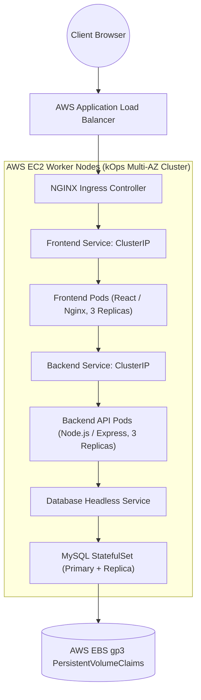
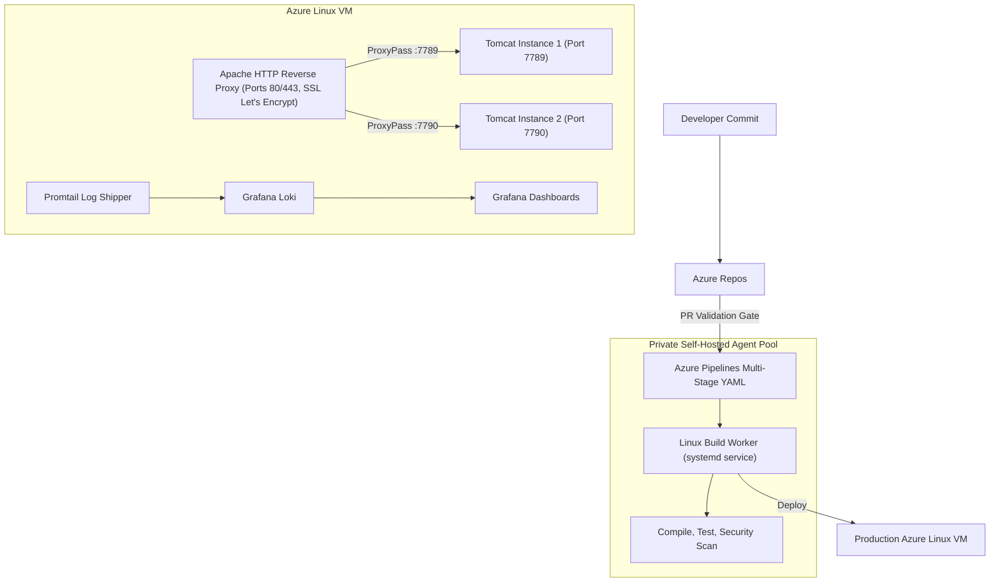

# 🏗️ Production Resume Projects: Deep-Dive Architecture Guide

> **Authoritative Technical Architecture Reference & Interview Defense Playbook**  
> Covers Architectural Decisions, Networking Topology, CI/CD Pipeline Flow, Observability Integration, and Technical Defense for Production Projects.

---

## 📑 Table of Contents
1. [Project 1: Multi-Tier Microservices on AWS Kubernetes (via kOps)](#1-project-1-multi-tier-microservices-on-aws-kubernetes-via-kops)
2. [Project 2: Azure DevOps CI/CD Pipeline Automation & Reverse Proxy](#2-project-2-azure-devops-cicd-pipeline-automation--reverse-proxy)
3. [Project 3: Taskflow Full-Stack Containerized Web Platform](#3-project-3-taskflow-full-stack-containerized-web-platform)
4. [High-Yield Architectural Interview Defense Questions](#4-high-yield-architectural-interview-defense-questions)

---

## 1. Project 1: Multi-Tier Microservices on AWS Kubernetes (via kOps)

### 1.1 Architectural Overview
A highly available, production-grade microservices deployment running on a self-managed Kubernetes cluster provisioned via **kOps** on AWS EC2 across multiple Availability Zones.

### 1.2 Core Architectural Decisions
* **Self-Managed kOps vs Managed EKS:** Chosen to demonstrate complete control over cluster lifecycle, master node provisioning, and etcd cluster configuration on AWS.
* **StatefulSets for Database Tier:** Used `StatefulSet` with `volumeClaimTemplates` to ensure predictable persistent volume attachments (`gp3` EBS) and ordered graceful restarts.
* **CoreDNS Internal Service Discovery:** Microservices communicate using Kubernetes internal DNS (`backend-service.default.svc.cluster.local`) rather than hardcoded IPs.

---

## 2. Project 2: Azure DevOps CI/CD Pipeline Automation & Reverse Proxy

### 2.1 Architectural Overview
An automated multi-stage CI/CD delivery platform using Azure DevOps, private Self-Hosted Linux build agents, multi-instance web servers behind an Apache reverse proxy, and full-stack LGTM observability.

### 2.2 Core Technical Highlights
* **Private Self-Hosted Agent:** Configured as a persistent `systemd` background service on Ubuntu Linux, providing zero pipeline queueing, local package caching, and private network access.
* **Apache Reverse Proxy:** Terminates SSL via Let's Encrypt, applies security headers (`X-Content-Type-Options: nosniff`), and transparently routes client traffic across isolated application runtimes.
* **LGTM Observability Stack:** Deployed Loki and Promtail to stream and index real-time access and error logs directly into Grafana dashboards.

---

## 3. Project 3: Taskflow Full-Stack Containerized Web Platform

### 3.1 Architectural Overview
A containerized full-stack task management platform built with React, Node.js, and MySQL, automated via Docker Compose and deployed to cloud infrastructure.

* **Multi-Stage Dockerfile:** Reduced production image footprint from ~1.1GB to 24MB using multi-stage builds and Alpine runtime.
* **Non-Root User Enforcement:** Enforced `USER 10001` in production container runtimes to mitigate container breakout vulnerabilities.
* **Automated Healthchecks:** Configured native Docker Compose healthcheck dependencies (`condition: service_healthy`) to eliminate database connection race conditions during startup.

---

## 4. High-Yield Architectural Interview Defense Questions

### Q1. Why did you choose StatefulSets instead of Deployments for MySQL in your Kubernetes project?
**Answer:** Deployments are designed for stateless workloads where pods are interchangeable and have random pod identities. A database requires:
1. Stable, persistent network identities (`mysql-0`, `mysql-1`).
2. Dedicated persistent storage that attaches to the exact same pod identity upon rescheduling.
3. Ordered, graceful startup and shutdown sequences to prevent database split-brain or data corruption.

### Q2. How did you handle secrets in your Azure DevOps pipeline?
**Answer:** Secrets were never stored in source code or plaintext YAML. They were managed through **Azure Key Vault** and mapped into Azure Pipelines via **Variable Groups**. During execution, secrets are masked with `***` in build console logs.
