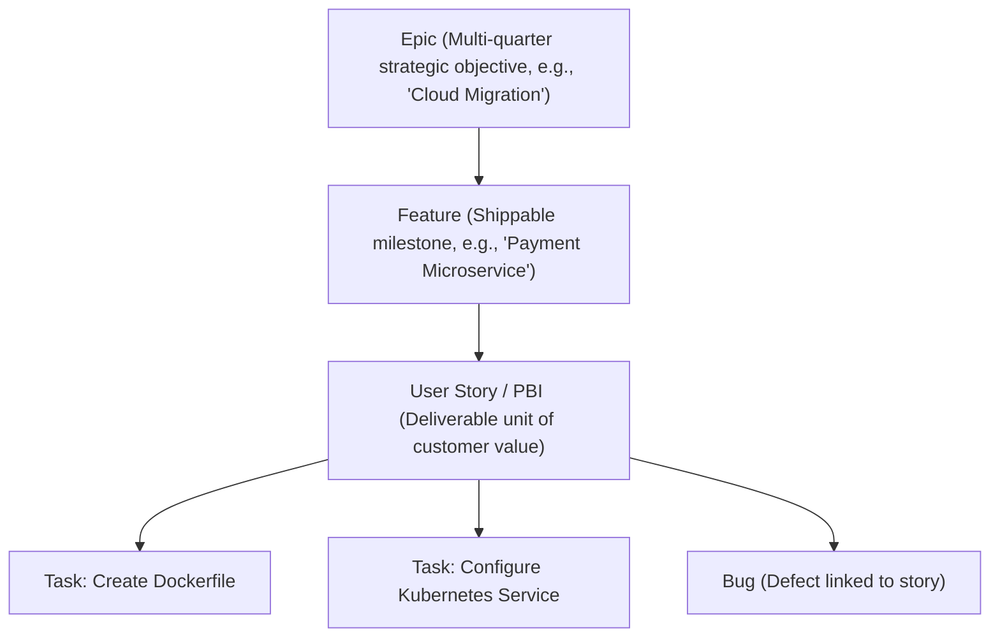
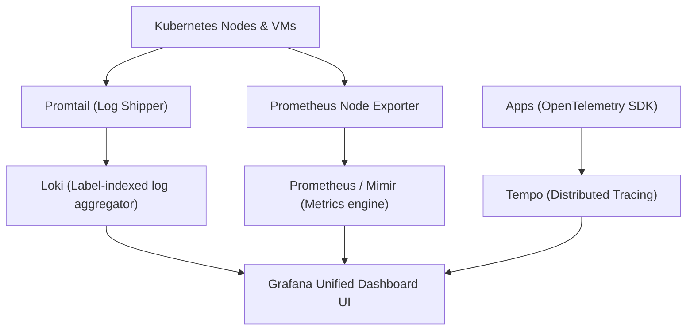

# 🔷 Azure DevOps & Observability: The Definitive Master Engineering Guide

> **Authoritative Enterprise Azure Engineering Reference & Senior Technical Interview Playbook**  
> Covers Azure Boards Agile Governance, Repos Branch Policies, Multi-Stage YAML Pipelines, Self-Hosted Linux Agent Pools, Apache Reverse Proxy, and the LGTM Observability Stack.

---

## 📑 Table of Contents
1. [Azure DevOps Platform Architecture](#1-azure-devops-platform-architecture)
2. [Azure Boards Agile Project Governance](#2-azure-boards-agile-project-governance)
3. [Azure Repos Security & Branch Policies](#3-azure-repos-security--branch-policies)
4. [Multi-Stage Production Azure YAML Pipelines](#4-multi-stage-production-azure-yaml-pipelines)
5. [Self-Hosted Linux Agent Pool Architecture & Automation](#5-self-hosted-linux-agent-pool-architecture--automation)
6. [Apache Reverse Proxy & SSL Configuration](#6-apache-reverse-proxy--ssl-configuration)
7. [The LGTM Enterprise Observability Stack](#7-the-lgtm-enterprise-observability-stack)
8. [Production Troubleshooting Playbook](#8-production-troubleshooting-playbook)
9. [Senior Azure DevOps Technical Interview Q&A](#9-senior-azure-devops-technical-interview-qa)

---

## 1. Azure DevOps Platform Architecture

Azure DevOps provides an integrated end-to-end DevOps ecosystem composed of 5 core services:
1. **Azure Boards:** Work tracking, Agile sprint backlogs, and Kanban workflows.
2. **Azure Repos:** Private Git repositories with pull request policies and branch protections.
3. **Azure Pipelines:** Multi-platform CI/CD automation supporting cloud-hosted and self-hosted runners.
4. **Azure Test Plans:** Manual and exploratory test case management.
5. **Azure Artifacts:** Universal package feeds (Maven, npm, NuGet, Python, Universal Packages).

---

## 2. Azure Boards Agile Project Governance

### 2.1 Work Item Hierarchy


### 2.2 Agile vs Scrum vs CMMI Process Templates
* **Basic:** Simple Issue-Task workflow for small teams.
* **Agile (Standard):** Epics -> Features -> User Stories -> Tasks/Bugs. Uses story points and sprint iterations.
* **Scrum:** Strict Scrum terminology (Product Backlog Items instead of Stories).
* **CMMI:** Formal audit-driven enterprise compliance tracking.

---

## 3. Azure Repos Security & Branch Policies

In enterprise environments, direct pushes to `main` are strictly forbidden. Configure the following **Branch Policies**:
1. **Require a minimum number of reviewers (Minimum: 2):** Prevents single-person merges.
2. **Check for linked work items:** Enforces traceability between Git commits and Azure Boards stories.
3. **Build Validation (CI Gate):** PR cannot be merged until an automated Azure Pipeline runs and passes all unit tests.
4. **Automatically included reviewers:** Automatically assigns Security/Architect leads for changes to sensitive folders (`infra/`, `k8s/`).
5. **Merge Strategy:** Require **Squash merge** or **Semi-linear merge** to maintain a clean git history.

---

## 4. Multi-Stage Production Azure YAML Pipelines

```yaml
trigger:
  branches:
    include:
      - main
      - release/*

variables:
  - group: production-vault-secrets  # Linked directly from Azure Key Vault
  - name: imageRepository
    value: 'cloudvault-api'
  - name: dockerfilePath
    value: '$(Build.SourcesDirectory)/Dockerfile'
  - name: tag
    value: '$(Build.BuildId)'

pool:
  name: 'Default'                   # Uses custom Self-Hosted Agent Pool

stages:
  # -------------------------------------------------------------
  # STAGE 1: Build & Quality Gate
  # -------------------------------------------------------------
  - stage: BuildAndTest
    displayName: 'Build, Scan and Package'
    jobs:
      - job: Compile
        displayName: 'Compile & Unit Tests'
        steps:
          - task: NodeTool@0
            inputs:
              versionSpec: '20.x'
          - script: |
              npm ci
              npm run test -- --coverage
            displayName: 'Execute Automated Test Suite'

          - task: Docker@2
            displayName: 'Build and Push Container Image'
            inputs:
              command: buildAndPush
              repository: $(imageRepository)
              dockerfile: $(dockerfilePath)
              containerRegistry: 'acr-production-service-connection'
              tags: |
                $(tag)
                latest

  # -------------------------------------------------------------
  # STAGE 2: Production Deployment with Approval Gates
  # -------------------------------------------------------------
  - stage: DeployProduction
    displayName: 'Deploy to Production Environment'
    dependsOn: BuildAndTest
    condition: and(succeeded(), eq(variables['Build.SourceBranch'], 'refs/heads/main'))
    jobs:
      - deployment: DeployWeb
        displayName: 'Deploy to AKS Cluster'
        environment: 'production-cloud-env' # Protected environment with manual approvals
        strategy:
          runOnce:
            deploy:
              steps:
                - task: KubernetesManifest@1
                  displayName: 'Deploy Kubernetes Manifests'
                  inputs:
                    action: deploy
                    connectionType: 'kubernetesServiceConnection'
                    kubernetesServiceConnection: 'aks-prod-connection'
                    manifests: |
                      $(Pipeline.Workspace)/manifests/deployment.yaml
                      $(Pipeline.Workspace)/manifests/service.yaml
                    containers: |
                      $(acrServer)/$(imageRepository):$(tag)
```

---

## 5. Self-Hosted Linux Agent Pool Architecture & Automation

### 5.1 Why Use Self-Hosted Agents?
* **Zero Minute Limits:** Bypasses Microsoft-hosted agent monthly minute quotas.
* **Network Isolation:** Resides directly inside your private VPC/VNet with access to internal databases, SonarQube, and private subnets.
* **Aggressive Caching:** Persistent build directories cache Docker layers, Maven `.m2` dependencies, and npm caches, reducing build times by 70%.

### 5.2 Production Setup Automation on Ubuntu Linux
```bash
# 1. Prepare installation directory
sudo mkdir -p /opt/azure-agent && cd /opt/azure-agent

# 2. Download latest Linux agent binary
sudo curl -O https://vstsagentpackage.azureedge.net/agent/3.238.0/vsts-agent-linux-x64-3.238.0.tar.gz
sudo tar zxvf vsts-agent-linux-x64-3.238.0.tar.gz

# 3. Configure agent connection non-interactively
sudo ./config.sh --unattended \
  --url "https://dev.azure.com/<YOUR_ORGANIZATION>" \
  --auth pat \
  --token "<YOUR_AZURE_DEVOPS_PAT_TOKEN>" \
  --pool "Default" \
  --agent "linux-build-worker-01" \
  --work "_work" \
  --replace \
  --acceptTeeEula

# 4. Install and enable systemd background service
sudo ./svc.sh install
sudo ./svc.sh start
sudo ./svc.sh status
```

---

## 6. Apache Reverse Proxy & SSL Configuration

When exposing private microservices to clients, Apache serves as an enterprise reverse proxy:

```apache
<VirtualHost *:80>
    ServerName api.cloudvault.net
    Redirect permanent / https://api.cloudvault.net/
</VirtualHost>

<VirtualHost *:443>
    ServerName api.cloudvault.net

    SSLEngine on
    SSLCertificateFile /etc/letsencrypt/live/api.cloudvault.net/fullchain.pem
    SSLCertificateKeyFile /etc/letsencrypt/live/api.cloudvault.net/privkey.pem

    # Security Headers
    Header always set X-Content-Type-Options "nosniff"
    Header always set X-Frame-Options "SAMEORIGIN"
    Header always set X-XSS-Protection "1; mode=block"

    # Reverse Proxy Directives
    ProxyPreserveHost On
    ProxyPass / http://127.0.0.1:8080/
    ProxyPassReverse / http://127.0.0.1:8080/

    # WebSocket Support
    RewriteEngine on
    RewriteCond %{HTTP:UPGRADE} ^WebSocket$ [NC]
    RewriteCond %{HTTP:CONNECTION} Upgrade$ [NC]
    RewriteRule .* ws://127.0.0.1:8080%{REQUEST_URI} [P]

    ErrorLog ${APACHE_LOG_DIR}/api_error.log
    CustomLog ${APACHE_LOG_DIR}/api_access.log combined
</VirtualHost>
```

---

## 7. The LGTM Enterprise Observability Stack

The modern cloud-native observability stack replaces heavyweight Elasticsearch (ELK) with lightweight **LGTM**:



### The 4 Pillars of LGTM
1. **Loki (Logs):** Indexes only metadata labels (`namespace`, `app`, `container`), storing raw logs compressed in object storage (S3/Azure Blob). Consumes **90% less memory** than ELK!
2. **Grafana (Visualization):** Single pane of glass correlating metrics, logs, and distributed trace spans.
3. **Tempo (Traces):** High-volume distributed tracing engine compatible with OpenTelemetry, Jaeger, and Zipkin.
4. **Mimir (Metrics):** Horizontally scalable, highly available long-term metrics storage for Prometheus.

---

## 8. Production Troubleshooting Playbook

### Scenario 1: Self-Hosted Agent Shows "Offline" in Azure DevOps
1. Check VM connectivity: `ping dev.azure.com`.
2. Check systemd service status: `sudo ./svc.sh status` or `systemctl status vsts.agent.*`.
3. Check agent diagnostic logs under `/opt/azure-agent/_diag/` for expired PAT tokens or proxy connection drops.

### Scenario 2: Pipeline Fails with "Authorization Failed" on Azure Resource Manager
1. Inspect the **Service Connection** in Azure DevOps Project Settings.
2. Verify the Azure AD App Registration client secret has not expired.
3. Migrate from static client secrets to **Workload Identity Federation** for automated certificate rotation.

---

## 9. Senior Azure DevOps Technical Interview Q&A

### Q1. What is the difference between an Azure DevOps Deployment Job and a regular Job?
* **Regular Job (`job:`):** Standard execution unit running a sequence of steps on an agent.
* **Deployment Job (`deployment:`):** Specialized job designed for releasing software to a target **Environment**:
  * Records deployment history and traceability against the specific environment.
  * Supports deployment lifecycle hooks: `preDeploy`, `deploy`, `routeTraffic`, `postRouteTraffic`, `on: failure/success`.
  * Allows gating deployments with manual approvals, business hour checks, and automated health check queries.

### Q2. How do you share variables across stages in Azure Pipelines?
* Use task output variables with stage dependencies:
  ```yaml
  # Stage 1: Export variable
  - script: echo "##vso[task.setvariable variable=BUILD_HASH;isOutput=true]$(Build.SourceVersion)"
    name: setVarStep

  # Stage 2: Reference variable
  variables:
    IMPORTED_HASH: $[ stageDependencies.Stage1.Job1.outputs['setVarStep.BUILD_HASH'] ]
  ```
