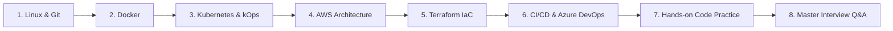

# 🚀 DevOps & Cloud Engineering Master Vault

Welcome to the **DevOps & Cloud Engineering Master Vault**. This repository is a centralized, production-grade knowledge base covering containerization, Kubernetes cluster orchestration, multi-cloud architecture (AWS & Azure), Infrastructure as Code (Terraform), CI/CD automation pipelines, Linux systems, and senior interview preparation.

---

## 🗺️ Recommended Study Roadmap (Where to Start & How to Move)

If you are preparing for technical interviews or revising your skills, follow this structured 8-phase roadmap:

* **Phase 1 (Foundations):** [06-Linux-and-Git](#06-linux-and-git) ➔ Master Linux kernel processes, troubleshooting commands (`top`, `netstat`, `curl`), and Git branch strategies.
* **Phase 2 (Containers):** [01-Docker](#01-docker) ➔ Learn multi-stage builds, non-root security, layer caching, and Docker Compose networking.
* **Phase 3 (Orchestration):** [02-Kubernetes-and-kOps](#02-kubernetes-and-kops) ➔ Understand Pods, Deployments, Services, probes, and kOps cluster management on AWS EC2.
* **Phase 4 (Cloud Infrastructure):** [03-AWS-Cloud-Architecture](#03-aws-cloud-architecture) ➔ Deep-dive into VPC multi-tier networking, NAT Gateways, EC2, S3, IAM, and FinOps cost optimization.
* **Phase 5 (Infrastructure as Code):** [04-Terraform-IaC](#04-terraform-iac) ➔ Master state files, locking with DynamoDB, lifecycle rules, and modular infrastructure code.
* **Phase 6 (Pipelines):** [05-CICD-Jenkins-Automation](#05-cicd-jenkins-automation) & [08-Azure-DevOps-Engineering](#08-azure-devops-engineering) ➔ Declarative Jenkinsfiles, SonarQube/Nexus, Azure Boards, and Azure YAML pipelines.
* **Phase 7 (Hands-On Coding):** [HANDS_ON_CODE_PRACTICE.md](07-Master-Interview-QnA/HANDS_ON_CODE_PRACTICE.md) ➔ Practice writing Dockerfiles, Compose, K8s YAML, and Terraform from memory.
* **Phase 8 (Final Interview Drill):** [07-Master-Interview-QnA](#07-master-interview-qna) ➔ Review the 173QA Complete Guide and Master Question Banks.

---

## 📑 Repository Table of Contents

### 🐳 01-Docker
Container architecture, build optimization, and multi-container environments:
* 📄 [`Docker_Complete_Guide.md`](01-Docker/Docker_Complete_Guide.md) — Comprehensive guide to Docker engines, storage, and networking.
* 📄 [`Docker_Master_Notes_and_Interview_QA.md`](01-Docker/Docker_Master_Notes_and_Interview_QA.md) — Core conceptual questions and production container patterns.
* 📄 [`Docker_Complete_Notes_with_Commands.md`](01-Docker/Docker_Complete_Notes_with_Commands.md) — Essential CLI cheat sheet (`build`, `exec`, `prune`, `inspect`, `network`).
* 📄 [`Docker_Interview_Guide.md`](01-Docker/Docker_Interview_Guide.md) — High-probability interview scenarios (CMD vs ENTRYPOINT, multi-stage benefits).
* 📄 [`DOCKER_NOTES.md`](01-Docker/DOCKER_NOTES.md) — Container lifecycle, layer architecture, and base image selection.
* 📄 [`docker_ongoing_.md`](01-Docker/docker_ongoing_.md) — In-depth container notes and real-world tips.
* 📄 [`docker_exp.md`](01-Docker/docker_exp.md) — Practical container troubleshooting notes.

---

### ☸️ 02-Kubernetes-and-kOps
Container orchestration, manifests, and production cluster operations:
* 📄 [`Kubernetes_Interview_Questions_and_Answers_.md`](02-Kubernetes-and-kOps/Kubernetes_Interview_Questions_and_Answers_.md) — 60,000+ characters of deep Kubernetes architectural Q&A.
* 📄 [`Kops_and_Kubectl_Installation_and_Setup_on_AWS.md`](02-Kubernetes-and-kOps/Kops_and_Kubectl_Installation_and_Setup_on_AWS.md) — Production kOps cluster setup on AWS EC2 with S3 state storage.
* 📄 [`kubernetes_kops_notes.md`](02-Kubernetes-and-kOps/kubernetes_kops_notes.md) — Control plane management, custom AMI nodes, and cluster upgrades.
* 📄 [`Kubernetes_Files_and_Kops_Setup_Explained.md`](02-Kubernetes-and-kOps/Kubernetes_Files_and_Kops_Setup_Explained.md) — Detailed explanation of kOps configuration files.
* 📄 [`Kubernetes_File_Types_Simple_Guide.md`](02-Kubernetes-and-kOps/Kubernetes_File_Types_Simple_Guide.md) — Differences between Pod, Deployment, Service, ConfigMap, and Secret.
* 📄 [`kubernetes_on_aws_eks.md`](02-Kubernetes-and-kOps/kubernetes_on_aws_eks.md) — Managed EKS vs self-managed kOps trade-offs.
* 📄 [`kubernetes_yaml_collection.md`](02-Kubernetes-and-kOps/kubernetes_yaml_collection.md) — Sample production manifest templates.
* 📄 [`kubernetes-notes.md`](02-Kubernetes-and-kOps/kubernetes-notes.md) — Core Kubernetes concepts (Probes, HPA, DaemonSets, StatefulSets).

---

### ☁️ 03-AWS-Cloud-Architecture
Enterprise AWS infrastructure, high availability, and FinOps:
* 📄 [`AWS_Core_Questions_Bank.md`](03-AWS-Cloud-Architecture/AWS_Core_Questions_Bank.md) — High-yield AWS questions (EC2, VPC, S3, IAM, CloudWatch).
* 📄 [`Aws_Interview_Questions_Answers.md`](03-AWS-Cloud-Architecture/Aws_Interview_Questions_Answers.md) — Concise senior interview responses.
* 📄 [`Aws_Services_Usage_Guide.md`](03-AWS-Cloud-Architecture/Aws_Services_Usage_Guide.md) — When to use which AWS service (ALB vs NLB, ECS vs EKS, RDS vs DynamoDB).
* 📄 [`aws_essential_ques_and_ans.md`](03-AWS-Cloud-Architecture/aws_essential_ques_and_ans.md) — Comprehensive technical breakdown of core AWS services.
* 📄 [`aws_handbook_.md`](03-AWS-Cloud-Architecture/aws_handbook_.md) — Full AWS cloud architect handbook.
* 📄 [`AWS_EC2_Deployment_Guide.md`](03-AWS-Cloud-Architecture/AWS_EC2_Deployment_Guide.md) — Step-by-step production VM deployment and web server provisioning.
* 📄 [`AWS_and_Terraform_QnA.md`](03-AWS-Cloud-Architecture/AWS_and_Terraform_QnA.md) — Combined questions on managing AWS via Terraform.
* 📄 [`TSR_AWS.md`](03-AWS-Cloud-Architecture/TSR_AWS.md) & [`TSR_AWS1.md`](03-AWS-Cloud-Architecture/TSR_AWS1.md) — Real-world field notes on AWS architecture and troubleshooting.
* 📄 Architecture Blueprint Summaries:
  * [`AWS_EC2_Blueprint.md`](03-AWS-Cloud-Architecture/AWS_EC2_Blueprint.md) — Compute, instance metadata (IMDSv2), placement groups.
  * [`AWS_VPC_Architecture_Blueprint-38-52.md`](03-AWS-Cloud-Architecture/AWS_VPC_Architecture_Blueprint-38-52.md) — Subnets, Route Tables, NAT Gateways, Internet Gateways.
  * [`AWS_IAM_Security_Blueprint-53-62.md`](03-AWS-Cloud-Architecture/AWS_IAM_Security_Blueprint-53-62.md) — Roles, Policies, STS, and Least Privilege.
  * [`AWS_Storage_Blueprint-73-78.md`](03-AWS-Cloud-Architecture/AWS_Storage_Blueprint-73-78.md) — S3 storage tiers, lifecycle policies, and EBS types.
  * [`AWS_Database_Architecture_Blueprint-79-87.md`](03-AWS-Cloud-Architecture/AWS_Database_Architecture_Blueprint-79-87.md) — RDS Multi-AZ, Read Replicas, and Aurora.
  * [`AWS_Troubleshooting_Playbook-96-103.md`](03-AWS-Cloud-Architecture/AWS_Troubleshooting_Playbook-96-103.md) — Debugging production outages and connectivity issues.

---

### 🏗️ 04-Terraform-IaC
Infrastructure as Code automation and state management:
* 📄 [`TERRAFORM_FULL_NOTES.md`](04-Terraform-IaC/TERRAFORM_FULL_NOTES.md) — Complete guide covering `init`, `plan`, `apply`, `refresh`, and state architecture.
* 📄 [`terraform_ttt.md`](04-Terraform-IaC/terraform_ttt.md) — Quick commands, variable precedence, and backend configuration.
* 📄 [`interviewQuestions.md`](04-Terraform-IaC/interviewQuestions.md) — Top Terraform interview questions (State file locking, drift, modules).
* 📄 [`t-1.md`](04-Terraform-IaC/t-1.md) — Practical HCL syntax examples.

---

### 🔄 05-CICD-Jenkins-Automation
Continuous Integration and Continuous Delivery automation:
* 📄 [`Jenkins_Interview_Guide.md`](05-CICD-Jenkins-Automation/Jenkins_Interview_Guide.md) — Declarative vs Scripted pipelines, agents, and shared libraries.
* 📄 [`Jenkins.md`](05-CICD-Jenkins-Automation/Jenkins.md) — Pipeline structure, environment blocks, credentials management.
* 📄 [`Updated_SonarQube_setup_and_Integration_with_Jenkins.md`](05-CICD-Jenkins-Automation/Updated_SonarQube_setup_and_Integration_with_Jenkins.md) — Static code analysis and quality gates integration.
* 📄 [`NEXUS_SETUP_AND_INTEGRATED_TO_JENKINS.md`](05-CICD-Jenkins-Automation/NEXUS_SETUP_AND_INTEGRATED_TO_JENKINS.md) — Artifact repository setup and publishing jar/war artifacts.
* 📄 [`Maven_Interview_Guide.md`](05-CICD-Jenkins-Automation/Maven_Interview_Guide.md) — Build lifecycle (`compile`, `test`, `package`, `install`, `deploy`).
* 📄 [`jenkins_interview_questions.md`](05-CICD-Jenkins-Automation/jenkins_interview_questions.md) — Core pipeline troubleshooting.

---

### 🐧 06-Linux-and-Git
Operating system internals, shell automation, and version control:
* 📄 [`Linux_Complete_Theory_Guide.md`](06-Linux-and-Git/Linux_Complete_Theory_Guide.md) — Linux kernel, process states (Zombie/Orphan), file permissions, and memory buffers.
* 📄 [`Linux_Shell_Scripting_Guide.md`](06-Linux-and-Git/Linux_Shell_Scripting_Guide.md) — Bash scripting best practices, error handling (`set -e`), and loops.
* 📄 [`linux_commands.md`](06-Linux-and-Git/linux_commands.md) — High-frequency system administration and diagnostic commands.
* 📄 [`Linux_Interview_Guide.md`](06-Linux-and-Git/Linux_Interview_Guide.md) — System troubleshooting scenarios (high CPU load, disk full, port debugging).
* 📄 [`Linux_DevOps_QA_411_to_485.md`](06-Linux-and-Git/Linux_DevOps_QA_411_to_485.md) — Targeted DevOps scenario questions.
* 📄 [`Git_Github_Interview_Guide.md`](06-Linux-and-Git/Git_Github_Interview_Guide.md) — Git merge vs rebase, cherry-pick, reset vs revert.
* 📄 [`Version_control_system_(git).md`](06-Linux-and-Git/Version_control_system_(git).md) — Git branching models (GitFlow, Trunk-Based Development).
* 📄 [`SF_git_cheatsheet.md`](06-Linux-and-Git/SF_git_cheatsheet.md) — Fast command reference for Git daily workflows.

---

### 🎯 07-Master-Interview-QnA
Core interview preparation guides, project breakdowns, and coding practice:
* 📄 [`173QA_Complete_Interview_Guide.md`](07-Master-Interview-QnA/173QA_Complete_Interview_Guide.md) — **173 Comprehensive Technical Questions** covering end-to-end DevOps.
* 📄 [`DevOps_Interview_QA_Master.md`](07-Master-Interview-QnA/DevOps_Interview_QA_Master.md) — 195,000+ characters of deep architectural interview scenarios.
* 📄 [`DevOps_Master_Guide_V2.md`](07-Master-Interview-QnA/DevOps_Master_Guide_V2.md) — Senior-level engineering and multi-cloud interview playbook.
* 📄 [`DevOps_Master_Study_Guide.md`](07-Master-Interview-QnA/DevOps_Master_Study_Guide.md) — High-yield revision guide.
* 📄 [`55QA_Core_Interview_Guide.md`](07-Master-Interview-QnA/55QA_Core_Interview_Guide.md) — The most frequently asked 55 interview questions.
* 📄 [`AWS_DEVOPS_150_MASTER_QUESTION_BANK.md`](07-Master-Interview-QnA/AWS_DEVOPS_150_MASTER_QUESTION_BANK.md) — 150+ master questions organized by AWS & DevOps categories.
* 📄 [`AWS_DEVOPS_INTERVIEW_CHEATSHEET.md`](07-Master-Interview-QnA/AWS_DEVOPS_INTERVIEW_CHEATSHEET.md) — Rapid 1-page revision sheet for last-minute review.
* 📄 [`DevOps_Quick_Revision_Notes.md`](07-Master-Interview-QnA/DevOps_Quick_Revision_Notes.md) — Fast-scan summary before interviews.
* 📄 [`HANDS_ON_CODE_PRACTICE.md`](07-Master-Interview-QnA/HANDS_ON_CODE_PRACTICE.md) — **Write code from memory**: Multi-Stage Dockerfile, Compose, K8s Deployment, Terraform S3/VPC, and Jenkinsfile.
* 📄 [`Projects_Architecture_Cheatsheet.md`](07-Master-Interview-QnA/Projects_Architecture_Cheatsheet.md) — Talking points and architecture for your real-world resume projects.
* 📄 [`Taskflow_Full_Stack_DevOps_Project_Guide.md`](07-Master-Interview-QnA/Taskflow_Full_Stack_DevOps_Project_Guide.md) — Complete case study on modern full-stack DevOps deployment.

---

### 🔷 08-Azure-DevOps-Engineering
Enterprise Azure DevOps pipelines, boards, and observability:
* 📄 [`Azure_DevOps_All_In_One_Master_Guide.md`](08-Azure-DevOps-Engineering/Azure_DevOps_All_In_One_Master_Guide.md) — 74,000+ characters covering Self-Hosted Agents, Agent Pools, and CI/CD.
* 📄 [`Azure_Pipelines_Deep_Dive.md`](08-Azure-DevOps-Engineering/Azure_Pipelines_Deep_Dive.md) — Multi-stage YAML pipelines, environments, approvals, and release gates.
* 📄 [`Azure_Boards_Management_and_Hierarchy.md`](08-Azure-DevOps-Engineering/Azure_Boards_Management_and_Hierarchy.md) — Epics, Features, User Stories, Sprints, and Agile governance.
* 📄 [`Azure_Repos_Governance_and_Branching.md`](08-Azure-DevOps-Engineering/Azure_Repos_Governance_and_Branching.md) — Branch policies, PR validations, and code review workflows.
* 📄 [`Azure_Self_Hosted_Agent_Pool_Setup.md`](08-Azure-DevOps-Engineering/Azure_Self_Hosted_Agent_Pool_Setup.md) — Installing and managing private build agents.
* 📄 [`Production_Azure_Pipelines_YAML.md`](08-Azure-DevOps-Engineering/Production_Azure_Pipelines_YAML.md) — Clean production YAML pipeline template.
* 📄 [`Azure_DevOps_Core_Guide.md`](08-Azure-DevOps-Engineering/Azure_DevOps_Core_Guide.md) — Overview of Azure DevOps service modules.
* 📄 [`LGTM_Observability_Stack_Guide.md`](08-Azure-DevOps-Engineering/LGTM_Observability_Stack_Guide.md) — Loki, Grafana, Tempo, and Mimir monitoring integration.
* 📄 [`Azure_App_Deployment_Guide.md`](08-Azure-DevOps-Engineering/Azure_App_Deployment_Guide.md) — Deploying services to Azure VMs and App Services.
* 📄 [`Azure_Apache_Reverse_Proxy.md`](08-Azure-DevOps-Engineering/Azure_Apache_Reverse_Proxy.md) — Reverse proxy and SSL configuration.

---

## 💡 Quick Tips for Revision
1. **Short on time?** Open [`AWS_DEVOPS_INTERVIEW_CHEATSHEET.md`](07-Master-Interview-QnA/AWS_DEVOPS_INTERVIEW_CHEATSHEET.md) and [`55QA_Core_Interview_Guide.md`](07-Master-Interview-QnA/55QA_Core_Interview_Guide.md).
2. **Asked to write code on the spot?** Practice typing from [`HANDS_ON_CODE_PRACTICE.md`](07-Master-Interview-QnA/HANDS_ON_CODE_PRACTICE.md).
3. **Deep technical round?** Dive into [`173QA_Complete_Interview_Guide.md`](07-Master-Interview-QnA/173QA_Complete_Interview_Guide.md) and the respective domain folders.
